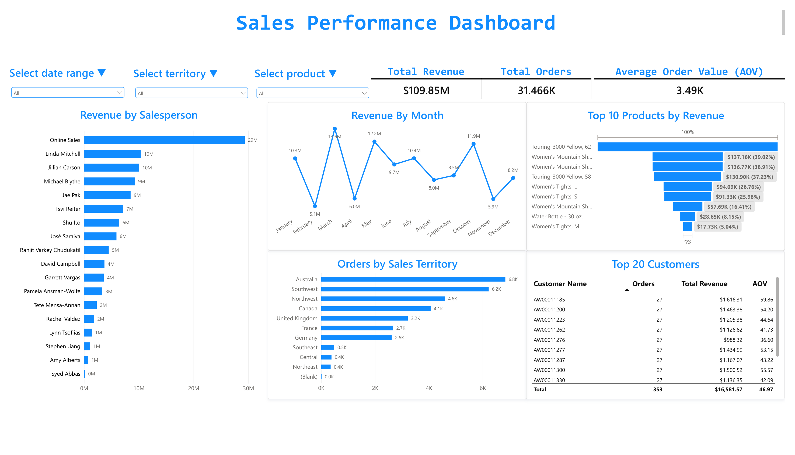

# AdventureWorks Analytics Platform

This repository contains the AdventureWorks data engineering and analytics platform for extraction, profiling, transformation, validation, and dashboard reporting.

## Current status
- Phase 3 (Sales Performance) is complete and validated.
- KPI checks passed against the independent Silver-layer baseline.
- Gold-layer unit tests passed successfully.
- Phase 4A Foundation W0-W3 is implemented and validated.
- Phase 4B Bronze runtime includes dedicated `bronze_staging`, persistent PostgreSQL audit/quarantine, atomic publish, retry/reconciliation, and staging cleanup lifecycle.
- Full regression currently passes with 88 tests.
- Current implementation branch: `phase_4B_EnhanceBronzeLayer`.

## Project goal
Build a clean medallion-style warehouse solution around AdventureWorks data with:
- Bronze: raw source ingestion and landing
- Silver: cleaning, normalization, and quality handling
- Gold: analytics-ready dimensions, facts, and KPIs
- Dashboard: executive-facing sales performance reporting

## Dashboard preview


## Repository structure

- docs/: project planning, architecture, checklist, specs, and issue tracking
- src/: application code and shared pipeline utilities
  - src/core/: centralized typed configuration and core logic
  - src/shared/ingestion/: shared TableSpec, result, retry, staging, audit, quarantine, publish, reconciliation, and checkpoint services
  - src/features/Sales_Performance/: Sales domain jobs and Bronze ownership
  - src/features/Production/: Production domain jobs and Bronze ownership
  - src/features/Person/: Person domain jobs and Bronze ownership
  - src/utils/: logger and helper utilities
- scripts/: operational jobs and database assets
  - scripts/source/: source-system extraction and profiling scripts
    - scripts/source/sqlserver/: SQL Server-specific profiling and extraction jobs
  - scripts/ingestion/: ingestion jobs
    - scripts/ingestion/bronze/: bronze ingestion scripts
  - scripts/warehouse/: warehouse setup and database objects
    - scripts/warehouse/postgres/: PostgreSQL warehouse schema and setup scripts
- tests/: automation and validation tests
- notebooks/: exploratory and analysis notebooks
- config/: environment and configuration assets
- Dashboard/: exported dashboard assets and preview images
- docker-compose.yml: local PostgreSQL warehouse setup
- main.py: application entry point that delegates to `App`
- requirements.txt: project dependencies
- .venv/: repository-local Python 3.11 64-bit environment (ignored by Git)

## Development environment

Use only the repository-local environment for this project:

```powershell
cd "A:\Workspace\DataEngineer\AdventureWorks Analytics Platform"
.\.venv\Scripts\Activate.ps1
```

Dependencies are defined in `requirements.txt` and have been installed in this environment. Do not use the older shared `A:\Workspace\DataEngineer\python\.venv` environment for project tests.

## Testing

Run Foundation tests without a live database:

```powershell
python -m pytest tests/test_settings.py tests/test_phase4a_w0_contract.py tests/test_phase4a_w2_domain_ownership.py tests/test_ingestion_models.py tests/test_retry_policy.py tests/test_staging_manager.py tests/test_checkpoint_manager.py tests/test_audit_service.py -q
```

Run the complete regression suite:

```powershell
python -m pytest -q
```

Latest validation: log-redaction `9 passed`; full regression `88 passed`.

## Phase 4B Bronze

Bronze extraction writes valid rows to run/load-specific tables in the PostgreSQL `bronze_staging` schema. Persistent run, table-load, batch-load, checkpoint, and rejected-record evidence is stored in PostgreSQL. Full-table validation gates publication; retry uses deterministic batch identity and database reconciliation to avoid blind appends. Failed or abandoned staging is retained for 24 hours before cleanup, while published staging is removed after audit completion.

Connector error logs contain only safe endpoint and exception-type information. Passwords and raw rejected payloads are excluded from application logs.

## Phase 4A Foundation

Phase 4A currently includes:

- W0 baseline and public API compatibility contracts
- W1 centralized `pydantic-settings` configuration with secret redaction and dependency injection
- W2 domain ownership separated into Sales, Production, and Person jobs using immutable `TableSpec`
- W3 shared ingestion result, retry, staging, audit, and checkpoint contracts

Execution details and evidence:

- [Phase 4A execution plan](docs/project/PHASE_4A_FOUNDATION_EXECUTION_VI.md)
- [Phase 4A English checklist](docs/ToDoCheckList/Phase_4_Review%26Enhance_Code/phase4a_foundation_execution.md)

## Branch workflow
- main: production-ready state
- dev: integration branch for active development
- feature/phase3-sales-performance: completed sales-performance work for the current delivery
- Phase4_A_EnhanceFoundation: active Phase 4A foundation implementation

## Working rules
The project follows a shared working standard applied across all sessions and environments:
- scope must be agreed before execution
- each task must have clear output, owner, and evidence
- ambiguous work is marked as Needs clarification before deep execution begins
- progress must be reviewed before moving to the next phase
- no phase is considered complete without explicit confirmation

## Notes
- This repository is intentionally separate from the legacy Python project folder.
- The Python folder remains untouched for historical or experimental work.
- The dashboard image in this README reflects the validated Phase 3 sales dashboard output.
