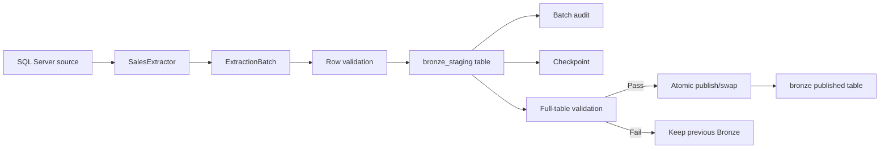

# Phase 4B - Bronze Layer Impact and Execution Plan

## 1. Purpose

This document translates the Bronze decisions from the Phase 4 review into an implementation scope, impact analysis, task breakdown, and verifiable acceptance criteria.

Phase 4B includes:

1. Change the Bronze extractor to `fetchmany(10_000)`.
2. Create staging and batch audit.  
3. Implement row-level quarantine.
4. Implement full-table validation and publish.
5. Implement retry, idempotency, and reconciliation.
6. Run Bronze regression tests.

Phase 4B builds on the completed W0-W3 foundation:

- Centralized `Settings` and dependency injection.
- Domain ownership split across Sales, Production, and Person.
- Immutable `TableSpec`.
- Shared result, retry, staging, audit, and checkpoint contracts.

## 2.1. Pipeline and component guide



The Bronze pipeline has three important layers:

1. **Read and batch**: read source rows without loading the entire table into memory.
2. **Stage and prove**: write candidate data to run-specific staging, while recording audit and checkpoint evidence.
3. **Validate and publish**: publish only after the complete staging load passes validation.

### 1. Extractor

File: `src/features/Sales_Performance/domain/bronze/sales_extractor.py`

Responsibilities:

- Read data from SQL Server.
- Split source data into batches of `Settings.batch_size` rows.
- Add lineage fields:

```text
_source_system
_source_table
_load_date
_record_hash
```

Example for a source table with 25,000 rows:

```text
Batch 1: rows 1 - 10,000
Batch 2: rows 10,001 - 20,000
Batch 3: rows 20,001 - 25,000
```

The extractor only reads and creates batches. It does not decide whether data is valid for publication.

### 2. Staging

Current contract: `src/shared/ingestion/staging_manager.py`

Staging is temporary data for one run and one table load.

Example:

```text
Published:
bronze.sales_order_detail

Staging:
bronze_staging.sales_order_detail__run123__load456
```

Purpose:

- Run a new load without changing Bronze currently used by Power BI.
- Keep the previous Bronze version available if a later batch fails.
- Publish only after the complete staging table passes validation.

Without staging, a direct `to_sql(..., if_exists="replace")` can leave Bronze empty or partial when a run fails.

### 3. Batch audit

Current contract: `src/shared/ingestion/audit_service.py`

Batch audit is technical execution history, not business data.

Example:

```text
run_id: run-123
load_id: load-456
batch_id: batch-002
batch_number: 2
lower_bound: 10001
upper_bound: 20000
rows_read: 10000
rows_written: 10000
status: SUCCESS
committed_at: ...
```

It answers:

- Which batch ran?
- How many rows were read and written?
- Which batch failed?
- How many attempts were made?
- Where can a restart safely resume?
- Was the data commit completed?

The current `AuditService` is in-memory. A production implementation must persist audit records in PostgreSQL so evidence survives process restart.

### 4. Checkpoint

Current contract: `src/shared/ingestion/checkpoint_manager.py`

A checkpoint is a progress marker that is known to have been committed successfully.

Example:

```text
last_committed_order_id = 20000
```

Required order:

```text
Write data successfully
    -> commit
        -> advance checkpoint
```

The reverse order is unsafe:

```text
Advance checkpoint
    -> data write fails
```

That sequence can cause the next run to skip rows that were never actually written.

### 5. Batch identity

The identity models are defined in `src/shared/ingestion/ingestion_models.py`.

There are three logical identities:

```text
run_id   = one pipeline execution
load_id  = one source-to-target table load within the run
batch_id = one ordered batch within the table load
```

Example:

```text
run_id:   run-001
load_id:  load-sales-order-detail-001
batch_id: batch-002
```

Attempts do not create a new batch identity:

```text
batch-002 attempt 1
batch-002 attempt 2
batch-002 attempt 3
```

This is what allows retry and reconciliation to avoid duplicates. For production idempotency, `batch_id` must be deterministic from the source table, ordering key, lower/upper bounds, and source snapshot rather than a new random UUID on every rerun.

### 6. Transaction boundary

A transaction is the boundary of operations that must commit or roll back together.

For one batch:

```text
BEGIN
  INSERT rows into staging
  commit data and checkpoint together
COMMIT
```

If the write fails:

```text
ROLLBACK
checkpoint does not advance
batch status = FAILED
```

The locked policy is:

- Data write and checkpoint commit use the same database transaction.
- Audit is written immediately after the data commit.
- An audit failure does not roll back committed data; it marks the run/table `FAILED_AUDIT` or `DEGRADED` and triggers alert/retry handling.

### 7. Full-table validation

Full-table validation runs after all batches have been written to staging.

Minimum checks:

- Source and staging row counts or reconciliation counts.
- Required columns and expected schema.
- Lineage columns.
- Primary key and null policy.
- Duplicate/idempotency key policy.
- Rejected threshold.
- Completeness of batch audit.

Flow:

```text
Batch 1 pass
Batch 2 pass
Batch 3 pass
    -> full-table validation
        -> pass: publish
        -> fail: keep previous Bronze
```

Full-table validation belongs to W4.4, not W4.2.

### 8. Publish

Publish changes a validated staging version into the official Bronze table:

```text
bronze_staging.sales_order_detail__run123__load456
    -> bronze.sales_order_detail
```

Publish occurs only after full-table validation. W4.2 writes and audits staging; W4.4 owns the atomic publish/swap boundary.

### 9. Cleanup and expire

Staging can have these lifecycle states:

```text
ACTIVE
PUBLISHED
FAILED
EXPIRED
CLEANED
```

Locked policy:

- Successfully published staging is cleaned after publish and audit completion.
- Failed or abandoned staging is retained for 24 hours for investigation/replay.
- Active staging is not cleaned while its run is active.
- A cleanup job is required to expire abandoned staging after the retention window.

Without cleanup, every run creates more staging objects and the database accumulates orphaned tables/metadata.

### 10. Reconciliation

Reconciliation handles an unknown commit outcome.

Example:

```text
Client writes 10,000 rows
Database commits
Client times out before receiving the response
```

Do not blindly retry because the data may already exist.

Required flow:

```text
Query staging/audit/idempotency key
    -> batch exists with the same identity/hash: skip insert
    -> batch does not exist: retry
    -> same identity with a different hash: fail closed
```

## Current implementation status

Implemented:

- Batch extractor using `fetchmany()`.
- In-memory staging metadata and batch tracking.
- In-memory batch/table audit.
- Checkpoint contract.
- Domain runner writing batches to staging.
- Duplicate batch protection.
- Unit tests for the foundation contracts.

Not implemented yet:

- PostgreSQL DDL for `bronze_staging` and persistent audit tables.
- Persistent audit after process restart.
- Cleanup/expire job with 24-hour retention.
- Database transaction integration tests.
- Full-table publish/swap.
- Production reconciliation service.

## 2.2. Decisions locked for Phase 4B

The following decisions are locked as the Phase 4B implementation baseline. They define physical design and operational policy; they do not mark a task `Done` until code, DDL, and tests exist.

| Topic | Locked decision | Rationale and trade-off |
|---|---|---|
| Staging schema | Use a dedicated PostgreSQL schema named `bronze_staging` | Separates temporary data from published Bronze and simplifies permissions/cleanup; requires additional DDL/migration |
| Staging name | `bronze_staging.<target_table>__<run_id>__<load_id>` after identifier validation | Traceable to a run/load; names are longer and identifiers need length limits |
| Persistent audit | PostgreSQL is the source of truth; in-memory service is only a test double/cache | Survives restart and is queryable; requires migration, retention, and audit-failure handling |
| Audit records | Store run, table-load, and batch-load audit | Supports both overview and detailed investigation/resume; creates more records |
| Batch identity | Deterministic from source table, ordering key, lower/upper bounds, and source snapshot; attempts never create a new ID | Enables rerun/reconciliation; requires stable source bounds |
| Duplicate batch | Same identity and same content hash is skipped/idempotent; same identity with a different hash fails closed | Safe retry and explicit source drift detection instead of silent overwrite |
| Transaction boundary | Staging data write and checkpoint commit in one transaction; audit is written immediately after commit | Prevents checkpoint from moving ahead of data; audit may need `AUDIT_FAILED` state after a post-commit failure |
| Audit failure | Do not roll back committed data; mark run/table `FAILED_AUDIT` or `DEGRADED`, alert, and retry audit | Preserves data integrity without hiding missing evidence |
| Cleanup/expire | Failed/abandoned staging is retained for 24 hours; published staging is cleaned after audit completion | Provides investigation/replay window; requires a cleanup job and timestamp policy |
| Empty source | Do not replace published Bronze with an empty table without explicit approval; return a zero-row result | Prevents data loss caused by source outage or incorrect filtering; empty full snapshots require operator approval |
| Publish | Atomic swap only after full-table validation; W4.2 does not publish | Keeps previous Bronze available when a new run fails; publishing belongs to W4.4 |

### Benefits and limitations of the locked design

- Dedicated `bronze_staging`: safer lifecycle and access control, but requires extra schema/DDL and database permissions.
- PostgreSQL audit: durable and queryable across restarts, but requires migration and retention policy.
- Deterministic batch identity: enables real retry/reconciliation, but depends on stable ordering keys and source snapshots.
- Data/checkpoint in one transaction: prevents checkpoint-before-data, but checkpoint persistence must use the same connection/transaction.
- Audit after commit: does not roll back data because evidence failed, but requires an explicit audit-failure state and alert/retry mechanism.
- 24-hour failed-staging retention: supports investigation, but consumes storage; a cleanup job is mandatory.

### W4.2 boundary

W4.2 owns staging identity, batch writes to staging, and batch/table audit. W4.2 does not own Bronze publication, row-level quarantine, or production retry; those belong to W4.3-W4.5.

## 2. Current baseline

| Area | Current baseline | Impact/risk |
|---|---|---|
| Extractor | `SalesExtractor.extract_table()` uses `cursor.fetchall()` and creates one DataFrame for the entire table | Memory grows with source size; no batch identity or resume boundary |
| Query ordering | Current query is `SELECT * FROM schema.table` without stable `ORDER BY` | Rerun and incremental progress are not deterministic |
| Bronze loader | `BronzeLoader.load()` writes directly to the target with `to_sql()` | Published Bronze may be replaced/appended before the run completes |
| Domain runner | `DomainBronzeJob` currently shares only basic extract/load/validate mechanics | No runtime run/load/batch audit, quarantine, retry, or publish gate |
| Validation | `BronzeValidator` mainly checks row-count parity; `validate_table()` is not fully used | Schema, lineage, required fields, and rejected thresholds do not block publish |
| Staging | `StagingManager` is currently a database-independent in-memory contract | No real staging table or atomic publish/swap |
| Audit | `AuditService` stores run/table/batch records in memory | Evidence is lost on restart; no database audit per batch/attempt |
| Retry | Classifier/retry policy contract exists | Not connected to read/write transactions or unknown-commit reconciliation |
| Checkpoint | `CheckpointManager` contract exists | Checkpoints are not written transactionally after successful batch commit |
| Tests | Foundation and full regression passed before Phase 4B | Acceptance tests are needed for batching, quarantine, publish safety, and rerun |

## 3. Impact analysis

### 3.1. Source extraction impact

Affected files/symbols:

- `src/features/Sales_Performance/domain/bronze/sales_extractor.py`
- `SalesExtractor.extract_table()`
- Domain jobs that call the extractor through `DomainBronzeJob`
- SQL Server connector cursor lifecycle

Required changes:

- Use `fetchmany(Settings.batch_size)` instead of `fetchall()` in the canonical Bronze path.
- Build the query with the ordering key from `TableSpec`.
- Return a batch iterator or batch result with bounds instead of one DataFrame for the whole table.
- Create lineage and `_record_hash` deterministically for each batch.
- Close the cursor safely when the source is exhausted or an exception occurs.

Compatibility impact:

- Keep an `extract_table()` wrapper if existing callers still require one DataFrame during migration.
- Add the batch API under a clear name, for example `iter_table_batches(spec, load_date)`.
- Existing fake-cursor tests must support `fetchmany()`.

### 3.2. Staging and batch audit impact

Affected files/symbols:

- `src/shared/ingestion/staging_manager.py`
- `src/shared/ingestion/audit_service.py`
- `src/shared/ingestion/ingestion_models.py`
- `BronzeLoader` and `DomainBronzeJob`

Required changes:

- Each run has a `run_id`; each table load has a `load_id`; each batch has a stable `batch_id`.
- Create staging tables from validated target and run/load identity values.
- Write valid rows only to staging, never directly to published Bronze.
- Record lower/upper bounds, counts, attempt count, status, and commit timestamp for every batch.
- An audit failure must not erase the data-commit state; the audit-failure policy must be explicit.

Database impact:

- Add DDL/migrations for pipeline run, table load, batch load, and staging metadata.
- Add a cleanup/expire policy for failed or abandoned run staging.
- Add indexes/unique protection for logical batch identity.

### 3.3. Row-level quarantine impact

Affected files/symbols:

- Bronze validation/loading boundary.
- `src/shared/ingestion/ingestion_models.py` result counts/status.
- PostgreSQL Bronze schema or rejected-record DDL.

Required changes:

- Distinguish row-level data errors from schema/system errors.
- Store isolatable row errors in `bronze.rejected_records` with reason, record key, source hash, and run/load/batch identity.
- Continue valid rows from the same batch into staging.
- Do not write full payloads to application logs; store raw payload in quarantine only when policy allows it.
- Include rejected counts in result and audit records.

Do not quarantine:

- Missing source table/column.
- Authentication or connection failure.
- Invalid query or contract failure.
- A failure that prevents safe identification of the record boundary.

### 3.4. Full-table validation and publish impact

Affected files/symbols:

- `BronzeValidator`.
- `StagingManager.publish()`.
- `BronzeLoader`/domain runner publish flow.
- Bronze DDL and integration tests.

Minimum validation gate:

- Source/staging row count or reconciliation count.
- Required columns and expected schema.
- Lineage columns and source-table value.
- Primary-key/null policy.
- Rejected threshold.
- Duplicate/idempotency-key policy.
- Batch-audit completeness.

Publish rule:

```text
source batches
  -> validated staging
      -> full-table validation
          -> validation pass: atomic publish/swap
          -> validation fail: keep previous Bronze, cleanup/expire staging
```

Published Bronze must not be dropped or replaced before all staging data passes validation.

### 3.5. Retry, idempotency, and reconciliation impact

Affected files/symbols:

- `src/shared/ingestion/retry_policy.py`.
- `src/shared/ingestion/checkpoint_manager.py`.
- `src/shared/ingestion/ingestion_models.py`.
- Transaction boundary in the Bronze loader/staging writer.

Mandatory rules:

- Retry transient errors only.
- Preserve `run_id`, `load_id`, and `batch_id` across all attempts.
- Retry one atomic batch; never blindly retry a partial write.
- Advance the checkpoint only after a successful data commit.
- If commit outcome is unknown, query audit/staging/idempotency keys and reconcile before retrying.
- Retry exhaustion must return `FAILED` and must not publish staging.

### 3.6. Test and operational impact

Add database-independent unit tests for mechanics and database-backed integration tests for transaction and publish behavior.

Required operational evidence:

- Run ID and table/load/batch IDs.
- Rows read/written/rejected.
- Attempt count and error class.
- Staging name/version.
- Validation and publish outcomes.
- Cleanup result after a failed run.

## 4. Task execution plan

### W4.1 - Batch extractor

| ID | Task | Output | Acceptance criteria | Status |
|---|---|---|---|---|
| 4.1.1 | Add `TableSpec` batch reader | `iter_table_batches()` or equivalent abstraction | Cursor uses `fetchmany(Settings.batch_size)` | Done |
| 4.1.2 | Add stable ordering | Query uses validated `ORDER BY spec.ordering_key` | Same input produces the same batch order | Done |
| 4.1.3 | Add batch bounds | Batch result has lower/upper key and batch number | Bounds match row data and audit | Done |
| 4.1.4 | Move lineage/hash into batch path | DataFrame batch contains complete metadata | Hash does not depend on run timestamp | Done |
| 4.1.5 | Preserve compatibility wrapper | Existing API callers remain functional | Existing Bronze tests pass | Done |

W4.1 implementation evidence:

- `SalesExtractor.iter_table_batches()` reads with `fetchmany(self.settings.batch_size)`.
- Canonical domain execution passes `TableSpec` and generates stable `ORDER BY` queries.
- Each yielded `ExtractionBatch` contains the DataFrame, batch number, lower bound, and upper bound.
- Lineage and deterministic `_record_hash` are added per batch.
- `extract_table()` remains available as a compatibility wrapper that aggregates batches.
- Validation: `python -m pytest tests/test_bronze_batch_extractor.py tests/test_bronze_ingestion_job.py tests/test_phase4a_w2_domain_ownership.py -q` -> `10 passed`.
- Full regression: `python -m pytest -q` -> `60 passed`.

### W4.2 - Staging and batch audit

| ID | Task | Output | Acceptance criteria | Status |
|---|---|---|---|---|
| 4.2.1 | Design staging naming/DDL | Run/load-specific staging table | Identifiers are validated; no SQL injection | In progress |
| 4.2.2 | Write valid rows to staging | Staging writer | Published Bronze is untouched before publish | Done |
| 4.2.3 | Write batch audit | Batch audit record/service | Counts, bounds, attempts, status, and commit time are complete | Done |
| 4.2.4 | Add cleanup/expire | Cleanup policy | Failed/abandoned staging does not remain indefinitely | Not started |
| 4.2.5 | Test transaction boundary | Fake and database transaction tests | Data commit and checkpoint ordering are proven | In progress |

Current W4.2 implementation evidence:

- `StagingManager` creates staging names from validated target/run/load identities.
- `StagingManager.write_batch()` stores batch number, bounds, row count, and rejects duplicate `batch_id` writes.
- `DomainBronzeJob` writes each extraction batch to staging instead of published Bronze.
- `AuditService` stores batch/table audit, queries batches by `load_id`, and rejects duplicate batch audits.
- Staging is not published yet; publish/atomic swap belongs to W4.4.
- Persistent staging cleanup/expire and database transaction integration tests remain pending.
- Focused validation: W4.2 staging/audit and Bronze regression -> `17 passed`.
- Full regression: `python -m pytest -q` -> `62 passed`.

### W4.3 - Row-level quarantine

| ID | Task | Output | Acceptance criteria | Status |
|---|---|---|---|---|
| 4.3.1 | Define rejected-record contract | `RejectedRecord` and `QuarantineService` | Identity, key/hash, reason, and timestamp are present | Done |
| 4.3.2 | Split valid/rejected rows | `BronzeValidator.partition_rows()` | Valid rows continue; rejected rows are not silently dropped | Done |
| 4.3.3 | Classify errors | Row/system/schema error policy | System/schema errors fail closed | Done |
| 4.3.4 | Add threshold | `BronzeValidator.validate_table()` rejection threshold | Threshold exceeded means validation `FAILED`, with no publish | Done |
| 4.3.5 | Test quarantine/redaction | `tests/test_bronze_quarantine.py` | No full payload in logs; reason is queryable | Done |

### W4.4 - Full-table validation and publish

| ID | Task | Output | Acceptance criteria | Status |
|---|---|---|---|---|
| 4.4.1 | Extend Bronze validation | `BronzeValidator.validate_staging()` full staging validation report | Schema, lineage, keys, counts, and threshold are checked | Done |
| 4.4.2 | Create publish boundary | `StagingManager.publish()` atomic in-memory boundary | Previous Bronze remains unchanged on validation/build failure | Done |
| 4.4.3 | Block partial publish | `StagingManager.mark_validated()` and `publish()` guards | Unvalidated staging cannot be published | Done |
| 4.4.4 | Return standard result | `DomainBronzeJob.run()` and `IngestionResult.to_dict()` | Status, counts, attempts, timestamps, and errors are present | Done |
| 4.4.5 | Test publish preservation | `tests/test_bronze_publish.py` | Failed validation does not remove valid existing Bronze | Done |

Current W4.4 implementation evidence:

- `BronzeValidator.validate_staging()` validates required columns, lineage columns and source-table values, primary-key NULLs, duplicate primary keys, row counts, rejected counts and rejection threshold.
- `StagingManager.mark_validated()` rejects a failed validation report; `publish()` only accepts validated staging and verifies the target table.
- Publish updates the staging state and published pointer together in the in-memory contract, so a failed validation cannot replace the previous published staging.
- `PostgresPublishService` performs the PostgreSQL atomic table swap; integration evidence is recorded in `tests/test_postgres_publish_reconciliation.py`.
- Focused validation: W4.4 publish/validation plus W4.2/W4.3 tests -> `12 passed`.
- `DomainBronzeJob.run()` now aggregates extracted batches for full-table validation, publishes only after a passing report, returns standard identity/count/status/timestamp/error fields, and skips publish for an empty source.
- UUID-based run/load identities are normalized with an `id_` prefix when needed so generated staging identifiers satisfy SQL identifier rules.
- Focused runtime validation: `python -m pytest tests/test_bronze_publish.py -q` -> `5 passed`.

### W4.5 - Retry/idempotency/reconciliation

| ID | Task | Output | Acceptance criteria | Status |
|---|---|---|---|---|
| 4.5.1 | Connect retry policy to read/write atomic unit | `execute_with_retry()` in `DomainBronzeJob` | Only transient errors are retried | Done |
| 4.5.2 | Preserve logical identity | `deterministic_batch_id()` and domain propagation | Attempts use the same run/load/batch IDs | Done |
| 4.5.3 | Write checkpoint after commit | `BronzeLoader.load_batch_transactionally()` and `PostgresCheckpointManager` | Checkpoint does not advance before data commit | Done |
| 4.5.4 | Reconcile unknown commit | `ReconciliationService` | No blind append after timeout/unknown commit | Done |
| 4.5.5 | Protect against duplicates | Content-hash-aware `StagingManager.write_batch()` | Rerunning the same input creates no duplicates | Done |
| 4.5.6 | Test exhaustion/rerun | `tests/test_bronze_retry.py` and retry contract tests | Exhaustion means `FAILED`, with no publish | Done |

Current W4.5 implementation evidence:

- `deterministic_batch_id()` derives a stable SHA-256 identity from source table, ordering key, lower/upper bounds and source snapshot.
- `DomainBronzeJob` uses the same logical batch identity across loader retry attempts and tracks the attempt count in batch/table results.
- `execute_with_retry()` retries only transient errors; deterministic errors fail immediately and exhaustion returns a failed domain result.
- `StagingManager` treats the same batch identity and content hash as idempotent, while a different hash fails closed.
- `ReconciliationService` returns `SKIP` for an already committed matching batch and `RETRY` only when no batch record exists.
- `PostgresReconciliationService` resolves durable registry evidence before retry; database integration evidence is recorded in `tests/test_postgres_publish_reconciliation.py`.
- W4.5 focused validation: `python -m pytest tests/test_bronze_retry.py -q` -> `4 passed`; related Bronze/shared suite -> `24 passed`.
- `BronzeLoader.load_batch_transactionally()` writes the staging batch and calls `PostgresCheckpointManager.advance_in_transaction()` on the same SQLAlchemy transaction.
- PostgreSQL integration tests prove successful commit persists both data and checkpoint, while checkpoint failure rolls back batch data.
- Transaction-aware loader integration is opt-in; legacy `load()` callers remain compatible.

### W4.6 - Bronze regression

| ID | Task | Output | Acceptance criteria | Status |
|---|---|---|---|---|
| 4.6.1 | Update fake-cursor tests | `tests/test_bronze_batch_extractor.py` `fetchmany()` fixtures | Batch size, order, and bounds are tested | Done |
| 4.6.2 | Run Foundation regression | W0-W3 tests | Existing contracts are not broken and coverage does not decrease | Done |
| 4.6.3 | Run Bronze unit tests | Bronze mechanics tests | Unit tests pass without a live database | Done |
| 4.6.4 | Run Bronze integration tests | PostgreSQL/SQL Server tests | Service readiness is recorded; failures are classified clearly | Done |
| 4.6.5 | Check rerun/failure behavior | `StagingCleanupJob` and acceptance scenario tests | Publish safety, quarantine, retry, and cleanup pass | Done |

W4.6 regression evidence:

- Foundation regression: `python -m pytest tests/test_settings.py tests/test_phase4a_w0_contract.py tests/test_phase4a_w2_domain_ownership.py tests/test_ingestion_models.py tests/test_retry_policy.py tests/test_staging_manager.py tests/test_checkpoint_manager.py tests/test_audit_service.py -q` -> `26 passed`.
- Bronze unit/transaction suite: `python -m pytest tests/test_bronze_batch_extractor.py tests/test_bronze_ingestion_job.py tests/test_bronze_quarantine.py tests/test_bronze_publish.py tests/test_bronze_retry.py tests/test_transactional_checkpoint.py -q` -> `21 passed`.
- SQL Server/PostgreSQL integration suite: `python -m pytest tests/test_phase0_connectivity.py -q` -> `5 passed`.
- Acceptance tests cover batch order/bounds, quarantine, validation/publish preservation, transient retry, retry exhaustion, idempotency/hash drift, transaction rollback and staging cleanup lifecycle.
- `StagingCleanupJob` uses an injected evaluation time for immediate retention testing: active/recent failed staging is retained, failed/abandoned staging is expired after 24 hours, and published staging is removed only after audit completion.

## 5. Dependencies and execution order

```text
W4.1 batch extractor
    -> W4.2 staging + batch audit
        -> W4.3 quarantine
            -> W4.4 full validation + publish
                -> W4.5 retry/idempotency/reconciliation
                    -> W4.6 Bronze regression
```

Do not implement production retry before staging identity, transaction boundaries, and checkpoint ordering are tested. Do not publish Bronze directly from the batch writer.

## 6. Test matrix

| Scenario | Test type | Expected result |
|---|---|---|
| Source contains more than one batch | Unit | `fetchmany(10000)` creates the correct batches and `fetchall()` is not used |
| Stable ordering | Unit | Batch order follows `TableSpec.ordering_key` |
| Empty source | Unit | Success result with zero counts; no invalid publish is created |
| Row-level invalid data | Unit/integration | Row is quarantined; valid rows still enter staging |
| Schema/missing column | Unit/integration | Table is `FAILED`; whole table is not quarantined and is not published |
| Staging write failure before commit | Unit/integration | Batch is rolled back; checkpoint does not advance |
| Transient read/write failure | Unit | Same batch identity is retried and attempt count increases |
| Deterministic error | Unit | No retry; result is `FAILED` |
| Unknown commit outcome | Integration | Reconcile before retry; no duplicate |
| Rejected threshold exceeded | Unit/integration | `FAILED`; staging is cleaned/expired and previous Bronze is preserved |
| Full validation failure | Integration | Existing published Bronze remains unchanged |
| Full validation pass | Integration | Staging is atomically published as Bronze |
| Rerun with the same input | Integration | No duplicate logical records |
| Audit write | Unit/integration | Complete run/table/batch evidence without secrets |

## 7. Commands and evidence

From the repository root, use the standard environment:

```powershell
cd "A:\Workspace\DataEngineer\AdventureWorks Analytics Platform"
.\.venv\Scripts\Activate.ps1
```

Foundation and regression commands:

```powershell
python -m pytest tests/test_settings.py tests/test_phase4a_w0_contract.py tests/test_phase4a_w2_domain_ownership.py tests/test_ingestion_models.py tests/test_retry_policy.py tests/test_staging_manager.py tests/test_checkpoint_manager.py tests/test_audit_service.py -q
python -m pytest -q
```

Bronze-focused command after the test files are created:

```powershell
python -m pytest tests/test_bronze_batch_extractor.py tests/test_bronze_staging.py tests/test_bronze_quarantine.py tests/test_bronze_publish.py tests/test_bronze_retry.py -q
```

Every task marked `Done` must record:

- File/symbol changed.
- Command executed.
- Pass/fail count.
- Database/service prerequisite, if applicable.
- Evidence for rollback, checkpoint, quarantine, retry, and publish safety when relevant.

## 8. Phase 4B Definition of Done

Status: **Production DoD chưa hoàn tất**. Các mục đánh dấu `[x]` là phần đã có implementation và evidence; các mục `[ ]` còn yêu cầu production integration.

- [x] Bronze extractor uses `fetchmany(Settings.batch_size)` and stable `ORDER BY`.
- [x] Every run/table/batch has logical identity and PostgreSQL-backed audit in production jobs; in-memory audit remains the unit-test double.
- [x] Valid rows are written to run-specific `bronze_staging` tables, never directly to published Bronze in the domain flow.
- [x] Row-level errors are quarantined with reason and identity in the domain runtime and persisted by `PostgresQuarantineService` for production jobs.
- [x] Schema/system errors fail closed and are not converted into quarantine rows in the validation contract.
- [x] Full-table validation runs before publish.
- [x] Existing Bronze remains unchanged when validation/publish fails; PostgreSQL atomic publish is implemented by `PostgresPublishService`.
- [x] Staging is published only after validation passes through in-memory and PostgreSQL atomic boundaries.
- [x] Retry applies only to transient errors and preserves logical identity.
- [x] Checkpoints advance only after successful data commit in the transaction-aware loader integration.
- [x] Unknown commit outcomes are reconciled before retry at the database level by `PostgresReconciliationService` and the durable batch registry.
- [x] Rerunning the same input does not create duplicate records in the content-hash staging contract.
- [x] Retry exhaustion returns `FAILED` and does not publish.
- [x] Audit contains counts, bounds, attempts, timestamps, and errors in PostgreSQL; production jobs inject `PostgresAuditService`.
- [x] Secrets and full payloads do not appear in application logs; connector errors log only safe endpoint and exception type.
- [x] Bronze unit tests run independently of a database.
- [x] Bronze integration/regression tests pass with PostgreSQL and SQL Server available.
- [x] README, checklist, and evidence reflect all remaining production limitations.

Remaining production gates: none for the listed Phase 4B production gates; README and log-redaction evidence are complete.

## 9. Risk register

| Risk | Impact | Mitigation |
|---|---|---|
| Source table lacks a suitable key/order | Batches are not deterministic | Require `TableSpec.ordering_key`; fail before extraction if missing |
| Cursor holds a connection for too long | Connection/resource pressure | Context manager, batch fetching, cursor close, and timeout policy |
| Too many quarantined rows | Bronze quality is insufficient | Explicit threshold, rejected-count audit, and no silent publish |
| Unknown commit | Duplicate data | Reconcile staging/audit/unique key before retry |
| Orphaned staging after crash | Storage/audit pollution | Cleanup/expire job and abandoned-run audit |
| Audit write failure | Evidence is lost | Separate data-commit/audit policy and sanitized fallback logging |
| Published Bronze replaced too early | Data availability loss | Full-table validation and atomic publish gate |
| Batch API breaks existing callers | Regression | Compatibility wrapper and API tests |

## 10. Evidence log

| Date | Task | Files/symbols | Validation command | Result | Status |
|---|---|---|---|---|---|
| 2026-09-04 | Create English Phase 4B impact and execution document | `docs/ToDoCheckList/Phase_4_Review&Enhance_Code/phase4b_bronzelayer_execution_en.md` | Markdown review | Created | Done |
| 2026-09-04 | Implement Bronze row-level quarantine contract and rejection threshold | `RejectedRecord`, `QuarantineService`, `BronzeValidator.partition_rows()`, `BronzeValidator.validate_table()` | `python -m pytest tests/test_bronze_quarantine.py tests/test_bronze_ingestion_job.py tests/test_staging_manager.py tests/test_audit_service.py -q` | 12 passed | Done |
| 2026-09-04 | Implement full-table validation and publish contract | `BronzeValidator.validate_staging()`, `StagingManager.mark_validated()`, `StagingManager.publish()` | `python -m pytest tests/test_bronze_publish.py tests/test_bronze_quarantine.py tests/test_bronze_ingestion_job.py tests/test_staging_manager.py -q` | 12 passed | Done |
| 2026-09-04 | Complete W4.4.4 standard result and DomainBronzeJob publish flow | `DomainBronzeJob.run()`, `IngestionResult.to_dict()`, `StagingManager._safe_identity()` | `python -m pytest tests/test_bronze_publish.py -q` | 5 passed | Done |
| 2026-09-04 | Implement W4.5 retry/idempotency/reconciliation contracts | `deterministic_batch_id()`, `ReconciliationService`, `StagingManager.write_batch()`, `DomainBronzeJob` retry integration | `python -m pytest tests/test_bronze_retry.py -q` | 4 passed | Done |
| 2026-09-04 | Implement W4.5.3 transactional checkpoint boundary | `PostgresCheckpointManager`, `BronzeLoader.load_batch_transactionally()` | `python -m pytest tests/test_transactional_checkpoint.py -q` | 2 passed | Done |
| 2026-09-04 | Complete W4.6 Bronze regression validation | Foundation, Bronze unit/transaction, and SQL Server/PostgreSQL integration suites | `26 passed`, `21 passed`, `5 passed` | Regression suites passed; cleanup lifecycle verified separately | Done |
| 2026-09-04 | Complete W4.6.5 staging cleanup and failure lifecycle regression | `StagingCleanupJob`, `StagingManager` lifecycle transitions, `tests/test_staging_cleanup.py` | `python -m pytest tests/test_staging_cleanup.py tests/test_staging_manager.py tests/test_bronze_publish.py tests/test_bronze_retry.py tests/test_bronze_quarantine.py -q` | 19 passed | Done |
| 2026-09-04 | Wire row-level quarantine into domain runtime | `DomainBronzeJob`, `QuarantineService`, `tests/test_bronze_quarantine.py` | `python -m pytest tests/test_bronze_quarantine.py -q` | 5 passed | Done |
| 2026-09-04 | Implement persistent audit and rejected-record repositories | `PostgresAuditService`, `PostgresQuarantineService`, `ensure_ingestion_schema()` | `python -m pytest tests/test_persistent_audit_quarantine.py tests/test_bronze_quarantine.py tests/test_bronze_publish.py tests/test_bronze_retry.py tests/test_audit_service.py tests/test_checkpoint_manager.py -q` | 20 passed | Done |
| 2026-09-04 | Route production Bronze loads to dedicated `bronze_staging` schema | `BronzeLoader.staging_schema`, `ensure_ingestion_schema()`, `StagingManager.create()` | `python -m pytest tests/test_bronze_staging_schema.py -q` | 1 passed | Done |
| 2026-09-04 | Implement PostgreSQL atomic publish and database reconciliation | `PostgresPublishService`, `PostgresReconciliationService`, `tests/test_postgres_publish_reconciliation.py` | `python -m pytest tests/test_postgres_publish_reconciliation.py -q` | 3 passed | Done |
| 2026-09-04 | Complete log-redaction integration evidence and README update | `redact_log_message()`, PostgreSQL/SQL Server connector error logging, `tests/test_log_redaction.py`, `README.md` | `python -m pytest tests/test_log_redaction.py tests/test_settings.py -q` | 9 passed | Done |
| 2026-09-04 | Run refactored pipeline from settings through current Sales Bronze | `main.py` -> `App` -> health -> bootstrap -> `SalesBronzeIngestionJob` | SQL Server/PostgreSQL runtime execution | Health/bootstrap `ok`; 5 Bronze tables `SUCCESS`, validation/publish `true`; 162,629 source/target rows matched | Done |
| 2026-09-04 | Re-run full regression after end-to-end pipeline | All repository tests | `python -m pytest -q` | 90 passed | Done |

## 11. Related documents

- `docs/internal/phase4_enhancement_execution_plan_spec.md`
- `docs/internal/phase4_review_enhance_spec.md`
- `docs/project/PHASE_4A_FOUNDATION_EXECUTION_VI.md`
- `docs/ToDoCheckList/Phase_4_Review&Enhance_Code/phase4a_foundation_execution.md`
- `src/shared/ingestion/ingestion_models.py`
- `src/shared/ingestion/retry_policy.py`
- `src/shared/ingestion/staging_manager.py`
- `src/shared/ingestion/checkpoint_manager.py`
- `src/shared/ingestion/audit_service.py`
