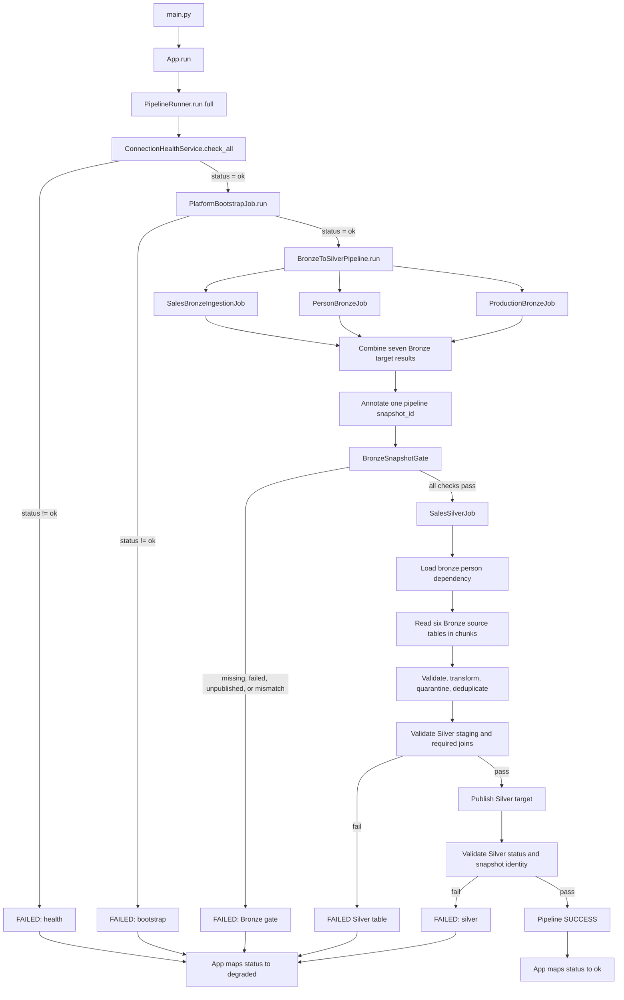

# Bronze-to-Silver Pipeline Run Evidence

## 1. Scope and accuracy

This document describes the current application path from `main.py` through the Bronze and Silver stages. It replaces the earlier Bronze-only execution description.

The current orchestration is:

```text
main.py
  -> App.run()
  -> PipelineRunner.run(mode="full")
  -> health gate
  -> platform bootstrap
  -> BronzeToSilverPipeline.run()
       -> Sales Bronze (5 targets)
       -> Person Bronze (1 target)
       -> Production Bronze (1 target)
       -> BronzeSnapshotGate
       -> SalesSilverJob (6 targets)
       -> Silver identity/result validation
  -> pipeline-level result
```

Gold is registered as a future extension but is not executed in this path. The pipeline result reports Gold as `NOT_REQUESTED`.

Evidence types used below:

- **Live run evidence:** the recorded execution on 2026-09-04. That run verified the five Sales Bronze tables only and must not be presented as a full seven-target Bronze-to-Silver run.
- **Automated contract evidence:** the current test suite, including the full three-domain same-snapshot test. This verifies orchestration behavior without requiring a live database.

## 2. Run information

| Item | Current value |
|---|---|
| Entry point | `main.py` |
| Application adapter | `App.run()` |
| Orchestrator | `PipelineRunner` |
| Requested stages | `bronze`, `silver` |
| Gold stage | `NOT_REQUESTED` |
| Source system | SQL Server `localhost\\HELIOS / AdventureWorks2012` |
| Warehouse | PostgreSQL `localhost:5432 / adventureworks_warehouse` |
| Python environment | `.venv\\Scripts\\python.exe` |
| Batch size | `10,000` in the recorded configuration |
| Retry attempts | `3` in the recorded configuration |
| Latest automated regression | `135 passed` |

## 3. End-to-end workflow



## 4. Step-by-step process and result data

### Step 1 - Application entry point

`main.py` performs no extraction or transformation:

```python
app = App()
return app.run()
```

`App.run()` delegates to `PipelineRunner.run(mode="full")`. It maps the runner status only at the outermost boundary:

- runner `SUCCESS` -> application `status="ok"`
- runner `FAILED` -> application `status="degraded"`

The remaining runner fields are preserved in the returned dictionary.

### Step 2 - Pipeline runner creates the run contract

`PipelineRunner` creates a pipeline `run_id`, records UTC start/end times, and sets:

```json
{
  "pipeline_name": "adventureworks",
  "mode": "full",
  "requested_stages": ["bronze", "silver"],
  "gold": {"status": "NOT_REQUESTED"}
}
```

The runner executes stages in this order and stops at the first failed gate:

1. Health.
2. Platform bootstrap.
3. Bronze-to-Silver pipeline.

`failed_stage` is one of `health`, `bootstrap`, `silver`, or `null`. Currently, Bronze gate failures and Silver failures are returned through the Bronze-to-Silver result and are surfaced by the runner as `failed_stage="silver"`.

### Step 3 - Configuration and health gate

`get_settings()` provides the typed configuration used by connectors, jobs, staging, retry, audit, and publish services. Safe configuration summaries must not include passwords.

`ConnectionHealthService.check_all()` checks both systems and disconnects each connector in a `finally` block. Its result shape is:

```json
{
  "status": "ok",
  "connections": [
    {
      "name": "sql_server",
      "status": "ok",
      "message": "sql_server connection successful"
    },
    {
      "name": "postgres",
      "status": "ok",
      "message": "postgres connection successful"
    }
  ]
}
```

If the overall status is not `ok`, Bootstrap and Bronze/Silver are not called. The runner returns `status="FAILED"` and `failed_stage="health"`.

### Step 4 - Platform bootstrap

After health succeeds, `PlatformBootstrapJob.run()` is called. The recorded run returned:

```json
{
  "status": "ok",
  "message": "bootstrap job executed"
}
```

Any non-`ok` result stops the pipeline and produces `failed_stage="bootstrap"`.

### Step 5 - Bronze domain routing

`BronzeToSilverPipeline` runs three domain jobs in the configured order:

| Domain job | Required target(s) |
|---|---|
| `SalesBronzeIngestionJob` | `bronze.sales_order_header`, `bronze.sales_order_detail`, `bronze.customer`, `bronze.sales_territory`, `bronze.sales_person` |
| `PersonBronzeJob` | `bronze.person` |
| `ProductionBronzeJob` | `bronze.product` |

All three jobs use the shared `DomainBronzeJob` mechanics. The individual domain jobs return mappings of target name to an ingestion result. The pipeline merges those mappings before applying the snapshot gate.

### Step 6 - Bronze table execution

For each Bronze table, `DomainBronzeJob.run()` performs the following:

1. Resolve or create the table `run_id` and `load_id`.
2. Create a run/load-specific staging table in `bronze_staging`.
3. Record run audit states.
4. Read source rows in ordered batches using the extractor.
5. Validate each batch and split valid rows from rejected rows.
6. Persist rejected records without writing raw rejected payloads to logs.
7. Check durable batch evidence for idempotent reconciliation.
8. Write valid rows, checkpoint, and batch registry transactionally.
9. Retry only according to the configured retry policy.
10. Validate the complete staging table.
11. Publish the validated table atomically to the `bronze` schema.

The staging name follows the implementation contract:

```text
bronze_staging.<target_table>__<run_fragment>__<load_fragment>
```

Long identifiers use deterministic fragments to fit PostgreSQL's 63-character identifier limit. Full UUID identities remain in result and audit metadata.

A successful Bronze table result contains fields such as:

```json
{
  "stage": "bronze",
  "source_table": "Sales.SalesOrderHeader",
  "target_table": "sales_order_header",
  "status": "SUCCESS",
  "run_id": "<table-run-id>",
  "load_id": "<table-load-id>",
  "rows_read": 31465,
  "rows_written": 31465,
  "rows_rejected": 0,
  "attempt_count": 1,
  "published": true,
  "staging_name": "bronze_staging.<...>",
  "validation_report": {"validation_passed": true}
}
```

The exact fields are returned by the shared `IngestionResult` contract; row counts vary by source data and execution date.

### Step 7 - Bronze failure behavior

Bronze does not proceed to Silver when any required target is missing, unsuccessful, unpublished, or invalid. Examples include:

- schema/system validation failure;
- rejected row threshold exceeded;
- failed staging validation;
- failed atomic publish;
- missing source `run_id` or `load_id`.

The gate result includes:

```json
{
  "status": "FAILED",
  "snapshot_id": "<pipeline-snapshot-id>",
  "required_targets": ["..."],
  "failures": ["..."],
  "table_count": 7
}
```

Silver is not called when this gate fails.

### Step 8 - One Bronze snapshot gate

After all domain results are merged, the pipeline creates one `snapshot_id`. Existing target snapshot identities are preserved; missing identities are annotated with the pipeline snapshot. This prevents an old snapshot identity from being silently overwritten.

`BronzeSnapshotGate` requires all seven targets:

```text
bronze.sales_order_header
bronze.sales_order_detail
bronze.customer
bronze.sales_territory
bronze.sales_person
bronze.product
bronze.person
```

For every target, it requires:

- status `SUCCESS` or `SUCCESS_WITH_REJECTIONS`;
- `published == true`;
- non-empty source `run_id` and `load_id`;
- a snapshot identity equal to the pipeline `snapshot_id`.

The full-domain automated test verifies that Sales, Person, and Production results combine into all seven targets and that every target has the same snapshot before Silver is called.

### Step 9 - Silver dependency loading

`SalesSilverJob` transforms six Bronze sources:

| Bronze source | Silver target |
|---|---|
| `bronze.sales_order_header` | `silver.sales_order_header_clean` |
| `bronze.sales_order_detail` | `silver.sales_order_detail_clean` |
| `bronze.customer` | `silver.customer_clean` |
| `bronze.sales_territory` | `silver.sales_territory_clean` |
| `bronze.product` | `silver.product_clean` |
| `bronze.sales_person` | `silver.sales_person_clean` |

`bronze.person` is not itself a Silver output table, but it is a required dependency for the `sales_person` transformation. Silver loads it before processing the six output tables and joins Person name attributes into `sales_person_clean`. Missing or incomplete Person data fails closed.

### Step 10 - Silver ordered chunk processing

For each Silver source, the job:

1. Reads the published Bronze table in ordered chunks using `batch_size`.
2. Adds `run_id`, `load_id`, `batch_id`, and `_record_hash` lineage.
3. Validates required input columns.
4. Converts dates, numeric, integer, and required string fields.
5. Persists conversion rejections through the Silver quarantine service.
6. Stops the table if the rejection threshold is exceeded.
7. Applies the table-specific cleaner.
8. Reconciles and commits each transformed batch to Silver staging.
9. Marks checkpoints only after the staged batch commit succeeds.

The six table execution order is:

```text
sales_order_header
sales_order_detail
customer
sales_territory
product
sales_person
```

### Step 11 - Silver validation and deduplication

Before publication, Silver applies:

- detail-grain duplicate validation for `sales_order_detail`;
- global primary-key deduplication using deterministic ordering;
- required output column validation;
- unexpected-column rejection;
- non-null primary-key validation;
- numeric output type validation;
- `sales_person` Person-join validation;
- rejected-row threshold validation.

The validation report includes fields such as:

```json
{
  "validation_passed": true,
  "schema_ok": true,
  "primary_key_nulls": 0,
  "duplicate_primary_keys": 0,
  "required_joins_ok": true,
  "rejected_threshold_ok": true,
  "source_count": 100,
  "target_count": 100,
  "rejected_count": 0,
  "issues": []
}
```

Counts in this example are illustrative. Production counts must come from the actual run result.

### Step 12 - Silver publish and table result

Only a validation-passed staging table is published. Depending on the configuration, publication uses the injected publish service or the default Silver writer, then marks the staging lifecycle as published.

A successful table result has the following shape:

```json
{
  "stage": "silver",
  "source_table": "sales_order_header",
  "target_table": "sales_order_header_clean",
  "status": "SUCCESS",
  "run_id": "<pipeline-snapshot-id>",
  "load_id": "<pipeline-snapshot-id>",
  "rows_read": 31465,
  "rows_valid": 31465,
  "rows_rejected": 0,
  "rows_deduplicated": 0,
  "rows_published": 31465,
  "published": true,
  "published_target": "sales_order_header_clean",
  "validation_report": {"validation_passed": true}
}
```

The status may be `SUCCESS_WITH_REJECTIONS` when rejected rows remain within policy. Any failed Silver table causes the overall Bronze-to-Silver result to be `FAILED`.

### Step 13 - Silver identity gate

After `SalesSilverJob.run()` returns, `BronzeToSilverPipeline` checks every Silver table result. Each result must have:

- an allowed status: `SUCCESS` or `SUCCESS_WITH_REJECTIONS`;
- `run_id == snapshot_id`;
- `load_id == snapshot_id`.

An identity mismatch prevents a successful pipeline result, even if the table status is otherwise `SUCCESS`.

The pipeline result contains:

```json
{
  "status": "SUCCESS",
  "snapshot_id": "<one-id>",
  "recovery": false,
  "bronze_gate": {"status": "SUCCESS"},
  "silver_identity": {
    "status": "SUCCESS",
    "snapshot_id": "<one-id>",
    "failures": [],
    "table_count": 6
  },
  "silver": {"<six silver results>": "..."}
}
```

### Step 14 - Pipeline-level result returned by App

`PipelineRunner` flattens the Bronze-to-Silver result into the application contract. A successful result has this shape:

```json
{
  "run_id": "<pipeline-run-id>",
  "pipeline_name": "adventureworks",
  "mode": "full",
  "requested_stages": ["bronze", "silver"],
  "status": "SUCCESS",
  "started_at": "<UTC ISO timestamp>",
  "finished_at": "<UTC ISO timestamp>",
  "duration_ms": 0,
  "failed_stage": null,
  "health": {"status": "ok", "connections": ["..."]},
  "bootstrap": {"status": "ok", "message": "..."},
  "bronze": {"<seven bronze results>": "..."},
  "bronze_gate": {"status": "SUCCESS", "table_count": 7},
  "snapshot_id": "<one-id>",
  "silver": {"<six silver results>": "..."},
  "gold": {"status": "NOT_REQUESTED"},
  "report_paths": []
}
```

`App.run()` returns the same fields with the outer status mapped to `ok`. There is no current `bronze_ok` field in the implementation; the old short-form example containing `bronze_ok` has therefore been removed.

## 5. Recovery and failure paths

### Health failure

```text
health != ok
  -> bootstrap not called
  -> Bronze not called
  -> failed_stage = health
  -> App status = degraded
```

### Bootstrap failure

```text
health ok
  -> bootstrap != ok
  -> Bronze/Silver not called
  -> failed_stage = bootstrap
  -> App status = degraded
```

### Bronze snapshot failure

```text
one required Bronze target missing/failed/unpublished/mismatched
  -> Silver not called
  -> bronze_gate.status = FAILED
  -> failed_stage = silver
  -> App status = degraded
```

### Silver failure or identity mismatch

```text
Bronze gate succeeds
  -> Silver table fails or identity does not match snapshot_id
  -> silver_identity.status = FAILED when applicable
  -> failed_stage = silver
  -> App status = degraded
```

### Recovery snapshot

When `recovery_snapshot` is supplied, Bronze execution is skipped. The provided `snapshot_id` and Bronze result mapping are validated, then Silver is called with that same identity. An invalid recovery snapshot fails before Silver with a failed Bronze gate result.

## 6. Evidence and validation status

### Automated evidence

The current repository-local environment was used:

```powershell
cd "A:\Workspace\DataEngineer\AdventureWorks Analytics Platform"
.\.venv\Scripts\python.exe -m pytest -q
```

Latest result after the orchestration and same-snapshot coverage updates:

```text
135 passed in 69.96s
```

The focused Bronze-to-Silver tests include:

- Bronze failure blocks Silver;
- missing required Bronze target is rejected;
- snapshot identity mismatch blocks Silver;
- default pipeline includes `PersonBronzeJob`;
- Sales, Person, and Production combine into one complete seven-target Bronze snapshot;
- Silver receives the same snapshot identity through `run_id` and `load_id`;
- Silver identity mismatch fails the pipeline.

### Live execution evidence

The recorded 2026-09-04 run used the local `.venv` and reached a successful application result for the refactored Sales Bronze path. It verified:

- SQL Server and PostgreSQL connectivity;
- five Sales Bronze tables;
- source/target row-count equality for those five tables;
- validation and publication for those five tables;
- batch, audit, checkpoint, reconciliation, retry, and cleanup behavior.

That run reported:

| Target | Source rows | Target rows | Rejected | Attempts | Published |
|---|---:|---:|---:|---:|---|
| `sales_order_header` | 31,465 | 31,465 | 0 | 1 | true |
| `sales_order_detail` | 121,317 | 121,317 | 0 | 1 | true |
| `customer` | 19,820 | 19,820 | 0 | 1 | true |
| `sales_territory` | 10 | 10 | 0 | 1 | true |
| `sales_person` | 17 | 17 | 0 | 1 | true |
| **Total** | **162,629** | **162,629** | **0** |  |  |

It did not provide live result data for `bronze.person`, `bronze.product`, or the six Silver tables. Therefore this document does not claim that the full seven-target Bronze-to-Silver production run has been completed.

## 7. Operational notes

- A pandas `FutureWarning` about concatenation with empty/all-NA entries was observed in the earlier live run. It did not change that run's reported results, but it remains a maintenance item.
- `StagingCleanupJob` is a scheduled lifecycle component. Published staging is eligible for cleanup after audit completion; failed or abandoned staging is retained for the configured retention period.
- Gold is intentionally disabled/not requested until its production contract and gate are enabled.
- Live full-pipeline evidence should be appended here only after one run records all seven Bronze targets, the Bronze gate, all six Silver targets, Silver identity validation, and the final pipeline-level result.
