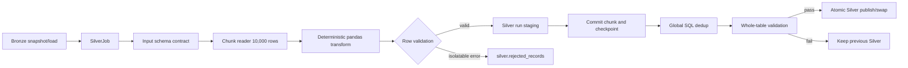

# Phase 4C - Silver Layer Impact and Execution Plan

## 1. Purpose

This document translates the approved Phase 4 Silver baseline into an implementation scope, impact analysis, task breakdown, and verifiable acceptance criteria.

Phase 4C covers:

1. Encapsulate Silver transformation as an injectable job/service.
2. Read Bronze in controlled chunks and apply deterministic pandas transformations.
3. Validate input schema and row-level conversion errors.
4. Quarantine isolatable row-level transformation errors.
5. Perform global deduplication on complete Silver staging data.
6. Make Silver validation a publication gate and publish atomically.
7. Run focused Silver regression tests and the appropriate repository regression suite.

Phase 4C does not redesign the Gold layer, change the approved Silver business model without a recorded decision, or remove legacy callable functions before compatibility evidence exists.

## 2. Baseline and current implementation

### 2.1 Confirmed implementation surface

| Area | Current location | Current behavior | Phase 4C concern |
|---|---|---|---|
| Silver cleaners | `scripts/transformation/silver/sales_silver_clean.py` | Six `clean_*` functions transform pandas DataFrames | Keep pure transformation behavior reusable while adding explicit contracts and error reporting |
| Silver orchestration | `scripts/transformation/silver/sales_silver_clean.py:run()` | Opens a connector, reads each Bronze table, transforms it, and writes directly to Silver | No injectable job/service or standard result |
| Bronze read | `_read_bronze()` | Uses `pd.read_sql_query()` without `chunksize` | Full Bronze table is loaded into memory |
| Type conversion | Cleaner functions | Uses `errors="coerce"` for dates and numeric values | Invalid source values can become NULL without a rejection reason |
| Deduplication | `_deduplicate()` | Uses `drop_duplicates(..., keep="last")` per DataFrame | Deduplication is not global across chunks and ordering is not explicit |
| Silver write | `run()` | Uses `to_sql(..., if_exists="replace")` against the published Silver schema | A failure can expose a partial or replaced Silver table |
| Person enrichment | `clean_sales_person()` and `run()` | Missing Person data prints a warning and falls back to the ID as a name | Approved baseline requires Person dependency failure unless degraded mode is explicitly approved |
| Validation | `scripts/transformation/silver/validate_silver.py` | Performs count, duplicate, NULL, and join checks against published tables | Validation is a standalone report, not a pre-publish gate |
| Shared contracts | `src/shared/ingestion/` | Provides settings, result/status, staging, audit, retry, checkpoint, and reconciliation foundations | Silver must reuse these contracts rather than create parallel mechanics |
| Existing tests | `tests/test_sales_silver.py` | Tests cleaner-level rename, conversion, trimming, and local dedup behavior | Tests need expansion for chunking, contracts, quarantine, staging, publish safety, and reruns |

### 2.2 Falsifiable implementation hypothesis

The primary Silver reliability failures are controlled by `run()`, `_read_bronze()`, `_deduplicate()`, and the direct `to_sql(..., if_exists="replace")` path. A focused test that injects a chunk reader and staging writer should demonstrate that a failed transformation or validation leaves the existing published Silver unchanged. If that test cannot be made to pass without changing the database publication boundary, the implementation must move one hop deeper to the staging/publish service rather than patching the cleaner functions.

### 2.3 Current public compatibility surface

The following behavior must remain available during migration unless a separate compatibility decision is recorded:

- `clean_sales_order_header(frame)`
- `clean_sales_order_detail(frame)`
- `clean_customer(frame)`
- `clean_sales_territory(frame)`
- `clean_sales_person(frame, person_frame=None)`
- `clean_product(frame)`
- `run()` as a legacy entrypoint, delegating to the new Silver job/service
- `CLEANERS` and `SILVER_TABLES` where existing callers import them

The compatibility wrapper must delegate only. New batching, quarantine, retry, staging, and publication logic belongs in the new service and shared components.

## 3. Target architecture



### 3.1 Ownership boundaries

| Component | Owns | Must not own |
|---|---|---|
| `SilverJob` or `SilverTransformationJob` | Table order, dependencies, chunk execution, result aggregation, and Silver policy | Connection environment parsing or duplicated retry/staging mechanics |
| Silver table specifications | Source/target names, required columns, key, ordering key, output columns, conversion rules, and enrichment dependency | Runtime state and database transactions |
| Pure `clean_*` functions | Deterministic mapping, trim, type conversion helper behavior, and output shaping | Database reads/writes, publication, retries, or hidden fallback policy |
| Shared staging manager/publish service | Run-specific staging identity, lifecycle, validation guard, cleanup, and atomic publication | Sales-specific transformation rules |
| Silver validator | Input/output schema, null/key/row-loss checks, rejected threshold, and referential checks | Repairing invalid source data or silently dropping rows |
| Quarantine service | Persisting rejected identity, reason, source hash, batch identity, and transform version | Logging full raw payload by default |
| Pipeline runner | Calling Silver and stopping Gold when Silver is not publishable | Silver transformation internals |

### 3.2 Required standard result

Every Silver table result must serialize through the shared result contract and include at least:

```text
run_id, load_id, batch_id, stage, source_table, target_table,
status, rows_read, rows_written, rows_rejected, attempt_count,
started_at, finished_at, error_type, error_message
```

Required Silver statuses:

| Status | Silver meaning |
|---|---|
| `SUCCESS` | All chunks and full-table checks pass; no rejected rows |
| `SUCCESS_WITH_REJECTIONS` | Valid rows pass, rejected rows are persisted, and the configured threshold explicitly allows publication |
| `FAILED` | System/schema/contract/validation error or rejected threshold exceeded; no new Silver version is published |
| `RETRYING` | A transient operation is being retried; it is not a terminal table result |
| `QUARANTINED` | Rejected-row evidence exists; the final table result must still resolve to `SUCCESS_WITH_REJECTIONS` or `FAILED` |

## 4. Impact analysis

### 4.1 Code impact

| Impacted area | Expected change | Risk | Mitigation/evidence |
|---|---|---|---|
| Silver script | Extract orchestration into a job/service and retain a delegating `run()` wrapper | Existing scripts/tests may depend on constructor-free `run()` | Compatibility test and legacy wrapper delegation test |
| Transformation functions | Add required-column and conversion reporting without changing approved output names | Existing cleaner tests may expect current output and local behavior | Preserve cleaner signatures; add explicit validation around them and update only tests that encode obsolete safety behavior |
| Database read | Introduce `read_sql_query(..., chunksize=settings.batch_size)` or an injected chunk reader | Chunk boundaries can alter results if dedup is local | Cross-chunk duplicate test and database-side global dedup |
| Database write | Write only to run-specific Silver staging | Staging cleanup and transaction handling can leave orphan objects | Reuse `StagingManager`, audit, checkpoint, cleanup, and reconciliation contracts |
| Validation | Convert `validate_silver.py` checks into an injectable validation service/gate | Existing report may check published tables after destructive writes | Validate staging before publish; retain report rendering as a compatibility/reporting surface |
| Person enrichment | Make `bronze.person` an explicit dependency for salesperson transformation | Current fallback can hide missing upstream data | Fail closed by default; degraded mode requires a separate approved decision and test |
| Shared ingestion | Reuse standard identity/status/result/retry/publish contracts | Parallel Silver-only infrastructure would drift from Bronze/Gold | Architecture/import review and shared contract tests |
| Pipeline orchestration | Silver failure must prevent Gold execution | A result-only validation could still allow downstream execution | Fake-job sequencing test in the pipeline layer |

### 4.2 Data and operational impact

- Silver will be built under a run-specific staging identity; the previously published Silver version remains readable until atomic publication succeeds.
- A full Bronze-to-Silver row-count match is not always expected after valid quarantine or approved global deduplication. The result must distinguish source rows, valid rows, rejected rows, and deduplicated rows.
- Every rejected row must retain run/load/table/batch identity, record key or source hash, error type, reason, and transformation version.
- Conversion errors must not be hidden by `errors="coerce"`. Nulls allowed by the schema remain valid only when the input value was valid or explicitly nullable.
- Global deduplication must use a deterministic ordering rule, initially `_load_date DESC, _record_hash DESC`, unless a separately approved source-version rule supersedes it.
- Silver publication failure must leave the existing published Silver tables and their version metadata unchanged.
- Gold must consume only a complete, validated Silver snapshot/load.

### 4.3 Out of scope and decisions required

| Item | Treatment |
|---|---|
| Customer name semantics | Existing code derives `customer_name` from `account_number`. Do not silently redefine it in Phase 4C. Record a business decision before changing the rule; keep the current rule as a compatibility baseline. |
| Person degraded mode | Not enabled by default. Missing `bronze.person` fails salesperson transformation. A degraded mode needs explicit approval, configuration, report semantics, and tests. |
| Gold implementation | Out of scope except for enforcing the Silver-to-Gold validation gate. |
| Database migration deployment | DDL for persistent Silver quarantine/audit/staging may be implemented here, but production migration rollout is tracked with the shared/database delivery workstream. |
| Arbitrary per-table classes | Avoid. Use immutable table specifications unless a table has materially different transformation, dependency, or publication behavior. |

## 5. Dependencies and execution order

```text
W1-W3 centralized settings/shared contracts
    -> W4-W5 Bronze snapshot, audit, identity, and retry evidence
        -> 6.1 Silver job/table specifications
            -> 6.2 input contracts and chunk reader
                -> 6.3 deterministic transform and conversion validation
                    -> 6.4 quarantine and threshold policy
                        -> 6.5 staging/checkpoint and global dedup
                            -> 6.6 whole-table validation gate
                                -> 6.7 atomic publish and compatibility wrapper
                                    -> 6.8 focused/regression tests
```

Do not implement Silver retry or publication changes before staging identity and transaction boundaries are testable. Do not use chunk-local `drop_duplicates()` as the final deduplication strategy. Do not mark a Silver result successful if validation fails or if rejected rows are not persisted.

## 6. Task breakdown

### 6.1 Package Silver as a job/service

| ID | Task | Output | Acceptance criteria | Dependency | Status |
|---|---|---|---|---|---|
| 6.1.1 | Define Silver table specifications | Immutable specs for six Silver targets, source table, key, required columns, ordering key, output schema, and dependencies | Every canonical table mapping is represented by a spec; no table map is hidden inside `run()` | W2/W3 | Not started |
| 6.1.2 | Create injectable Silver job | `SilverTransformationJob` or equivalent with settings, reader, transformer, writer, validator, quarantine, audit, and publish dependencies | Job can run with fakes without a live database and returns standard per-table results | 6.1.1 | Not started |
| 6.1.3 | Define table/dependency order | Explicit order for dimensions and salesperson Person dependency | Missing required Bronze table fails with table and dependency context | 6.1.1 | Not started |
| 6.1.4 | Preserve legacy entrypoint | Existing `run()` delegates to the job/service | Existing cleaner imports and legacy `run()` callers remain functional; wrapper contains no new mechanics | 6.1.2 | Not started |

### 6.2 Chunked read and deterministic pandas transformation

| ID | Task | Output | Acceptance criteria | Dependency | Status |
|---|---|---|---|---|---|
| 6.2.1 | Implement chunk reader | Injected reader or `read_sql_query(..., chunksize=settings.batch_size)` | Canonical path never calls `fetchall()` or loads a complete Bronze table; default chunk size is 10,000 | 6.1 | Not started |
| 6.2.2 | Add stable source ordering | Query/spec uses validated `ORDER BY` on the source key | Repeated reads of the same Bronze snapshot produce the same chunk order and bounds | 6.2.1 | Not started |
| 6.2.3 | Add batch identity and lineage | Reuse `run_id`, `load_id`, `batch_id`; preserve source hash/load metadata | Retry of a chunk keeps logical identity; hash is deterministic for the same source record | 6.2.1 | Not started |
| 6.2.4 | Make transformations deterministic | Refine cleaner path for mapping, trim, dates, numeric values, flags, and enrichment | Same input snapshot and transformation version produce equivalent output independent of chunk boundaries | 6.2.1 | Not started |
| 6.2.5 | Remove unsafe silent fallback | Enforce Person dependency for salesperson transformation | Missing `bronze.person` returns `FAILED` and does not publish salesperson Silver; no `print()` fallback | 6.1.3 | Not started |

### 6.3 Input and conversion validation

| ID | Task | Output | Acceptance criteria | Dependency | Status |
|---|---|---|---|---|---|
| 6.3.1 | Validate Bronze input schema | Required-column validator per table | Missing table or column is a table-level `FAILED` result and is not converted into row quarantine | 6.1.1 | Not started |
| 6.3.2 | Define output schema contract | Expected output columns, key, nullability, and types | Transformed staging data is checked before publication; missing or unexpected required output fails closed | 6.3.1 | Not started |
| 6.3.3 | Detect conversion failures | Conversion helper/report for dates, integers, decimals, and required strings | Invalid non-null source value produces a row rejection with field and reason; valid nullable values remain valid NULLs | 6.2.4 | Not started |
| 6.3.4 | Track row-loss categories | Counts for source, valid, rejected, deduplicated, and published rows | Results distinguish rejection from deduplication and never report silently dropped rows | 6.3.3 | Not started |

### 6.4 Row-level quarantine

| ID | Task | Output | Acceptance criteria | Dependency | Status |
|---|---|---|---|---|---|
| 6.4.1 | Define Silver rejection contract | `RejectedRecord` usage with `transform_version` and source identity | Record contains run/load/table/batch, key or hash, error type, reason, and timestamp | W3/6.3 | Not started |
| 6.4.2 | Persist rejected rows | `silver.rejected_records` repository/service or approved equivalent | Rejected rows are queryable outside normal logs and are not silently discarded | 6.4.1 | Not started |
| 6.4.3 | Continue valid rows | Batch partition into valid and rejected rows | A row-level conversion error does not discard other valid rows in the same batch | 6.3.3/6.4.1 | Not started |
| 6.4.4 | Enforce rejection threshold | Explicit settings/policy, default `0` | Within approved threshold yields `SUCCESS_WITH_REJECTIONS`; threshold exceeded yields `FAILED` and blocks publish | 6.4.2 | Not started |
| 6.4.5 | Redact operational logs | Structured rejection/error logging | Logs contain metadata and reason but no password or full raw payload by default | 6.4.2 | Not started |

### 6.5 Staging, global deduplication, retry, and checkpoint

| ID | Task | Output | Acceptance criteria | Dependency | Status |
|---|---|---|---|---|---|
| 6.5.1 | Create run-specific Silver staging | Staging table/schema per run and table load | Published Silver is untouched while chunks are being processed | W3/6.1 | Not started |
| 6.5.2 | Commit each valid chunk | Transaction boundary and batch audit | Data commit, audit/checkpoint ordering, and attempt count are observable; checkpoint advances only after successful commit | W3/6.2 | Not started |
| 6.5.3 | Retry only transient errors | Shared retry policy around an atomic chunk operation | Retry preserves logical identity; deterministic schema/contract/validation errors are not retried | W5/6.5.2 | Not started |
| 6.5.4 | Reconcile unknown commit | Shared reconciliation service before retry | A timeout after commit does not append the same logical chunk twice | W5/6.5.2 | Not started |
| 6.5.5 | Implement global dedup | SQL window function or equivalent over complete staging data | Duplicate keys spanning separate chunks are resolved once using deterministic `_load_date DESC, _record_hash DESC`; chunk-local dedup is not the final rule | 6.5.1/6.2.3 | Not started |
| 6.5.6 | Preserve fact-relevant detail grain | Detail key validation | `sales_order_detail_id` is unique after Silver staging; duplicate key behavior is explicit and testable | 6.5.5 | Not started |

### 6.6 Validation gate and atomic publish

| ID | Task | Output | Acceptance criteria | Dependency | Status |
|---|---|---|---|---|---|
| 6.6.1 | Adapt Silver validation to staging | Injectable validator based on existing table and join checks | Schema, key, duplicate, null, row-loss, rejection threshold, and required join checks run against staging | 6.5.5 | Not started |
| 6.6.2 | Add pre-publish gate | Table and stage result policy | Any required validation failure returns `FAILED`, and downstream Gold is not called | 6.6.1 | Not started |
| 6.6.3 | Publish atomically | Reuse/extend PostgreSQL publish service | Existing Silver remains unchanged if transform, validation, constraint, or publish fails | 6.6.2 | Not started |
| 6.6.4 | Record publication metadata | Audit/version/publish result | Result identifies staging, published version, counts, validation status, and failure reason without secrets | 6.6.3 | Not started |
| 6.6.5 | Clean up failed staging | Expire/cleanup policy | Failed or abandoned staging is not published and is cleaned up according to retention policy | 6.6.3 | Not started |

### 6.7 Silver regression and delivery evidence

| ID | Task | Output | Acceptance criteria | Dependency | Status |
|---|---|---|---|---|---|
| 6.7.1 | Extend cleaner unit tests | Focused tests for mappings and deterministic transformations | Existing valid cleaner behavior remains covered | 6.2.4 | Not started |
| 6.7.2 | Add chunk/contract tests | Fake reader and fake writer tests | Chunk size, stable order, missing schema, conversion detection, and chunk-boundary independence pass without a database | 6.2/6.3 | Not started |
| 6.7.3 | Add quarantine tests | Fake quarantine repository tests | Valid rows continue, rejected rows include identity/reason, and threshold status is correct | 6.4 | Not started |
| 6.7.4 | Add dedup/retry tests | Cross-chunk duplicate, transient retry, unknown commit, and checkpoint tests | One logical operation is written once; deterministic errors are not retried | 6.5 | Not started |
| 6.7.5 | Add publish-safety tests | Staging/publish fake and PostgreSQL integration tests | Failed validation/build preserves old Silver; successful validation publishes the complete new version | 6.6 | Not started |
| 6.7.6 | Add orchestration gate test | Fake pipeline stage test | Silver failure or validation failure prevents Gold execution | 6.6.2 | Not started |
| 6.7.7 | Run Silver regression | Focused and repository suites | Focused Silver tests pass; unit suite remains independent of external services; integration results identify unavailable prerequisites | All prior tasks | Not started |

## 7. Verifiable acceptance criteria

### 7.1 Job and contract acceptance

- [ ] A Silver job/service accepts injected settings and dependencies and returns standard results for every attempted table.
- [ ] The legacy `run()` entrypoint delegates to the new service and existing cleaner imports remain available.
- [ ] Results include status, counts, duration/timestamps, error type/message, and run/load/batch identity.
- [ ] Missing Bronze table, missing required column, missing Person dependency, and system errors fail closed with table context.

### 7.2 Read and transformation acceptance

- [ ] Canonical Silver reads use controlled chunks with `Settings.batch_size`, initially 10,000 rows.
- [ ] Canonical reads use stable ordering and do not use `fetchall()`, offset checkpoints, or page-number resume.
- [ ] Transform output is deterministic for the same Bronze snapshot and transformation version, regardless of chunk boundaries.
- [ ] Required source conversion failures are identified and rejected with field-level reason; `errors="coerce"` is not used as silent error handling.
- [ ] Person enrichment is explicit and missing Person data does not silently produce salesperson names from IDs.

### 7.3 Quarantine and dedup acceptance

- [ ] Valid rows from a mixed batch are staged while invalid rows are persisted to `silver.rejected_records` or the approved equivalent.
- [ ] Each rejection includes run/load/table/batch identity, record key or source hash, reason, error type, transform version, and timestamp.
- [ ] Rejected threshold defaults to `0` and is visible in the result/audit; publication status is `SUCCESS_WITH_REJECTIONS` only when policy allows it.
- [ ] Duplicate keys spanning two or more chunks are handled by one global deterministic staging rule, not independent chunk deduplication.
- [ ] A duplicate `sales_order_detail_id` that violates the approved rule fails closed rather than being silently dropped.

### 7.4 Reliability and publication acceptance

- [ ] A transient read/write failure retries the same logical chunk with the same run/load/batch identity.
- [ ] A deterministic schema, contract, or validation error is not retried.
- [ ] An unknown commit outcome is reconciled before another write attempt.
- [ ] Checkpoint advancement occurs only after the corresponding staging data commit succeeds.
- [ ] Silver staging is run-specific and is not visible as the published Silver version during processing.
- [ ] A transformation, validation, constraint, or publish failure leaves the previous published Silver unchanged.
- [ ] Atomic publish occurs only after full staging validation passes.
- [ ] Failed or abandoned staging is marked/cleaned according to the shared lifecycle policy.

### 7.5 Pipeline and security acceptance

- [ ] Silver validation is a required pipeline gate; Gold is not called after Silver failure.
- [ ] Structured logs include applicable run/stage/table/load/batch/attempt/status/count fields.
- [ ] Passwords, full connection strings, and full raw rejected payloads do not appear in logs or rendered reports.
- [ ] A machine-readable summary identifies source count, valid count, rejected count, deduplicated count, publication status, and errors.

## 8. Test matrix and commands

### 8.1 Required scenarios

| Scenario | Test type | Expected result |
|---|---|---|
| Valid cleaner transformation | Unit | Existing column mapping, trimming, flags, and types remain correct |
| Bronze table contains more than one chunk | Unit | Reader requests configured chunk size and yields stable ordered chunks |
| Canonical path inspection | Unit/static review | No `fetchall()`, full-table `read_sql_query()` without chunksize, or direct published `replace` write |
| Missing input table/column | Unit/integration | Table result is `FAILED`; no whole-table quarantine; old Silver remains |
| Invalid numeric/date value | Unit | Row is quarantined with field/reason; valid rows continue |
| Rejected threshold exceeded | Unit/integration | Result is `FAILED`; staging is not published |
| Duplicate across chunk boundary | Unit/integration | Global staging dedup applies deterministic rule once |
| Missing Person dependency | Unit/integration | Salesperson transformation fails closed; no ID-name fallback |
| Transient read/write error | Unit | Same logical batch retries with bounded attempts and recorded outcome |
| Unknown commit | Integration | Reconciliation prevents duplicate staging rows |
| Checkpoint ordering | Unit/integration | Checkpoint is written only after data commit |
| Silver validation failure | Unit/integration | Existing Silver remains unchanged and Gold is not invoked |
| Successful atomic publish | Integration | Complete validated staging becomes published Silver |
| Same input rerun | Integration | Published output is deterministic and has no duplicate logical keys |
| Secret/redaction behavior | Unit | Password and full raw payload are absent from logs/reports |

### 8.2 Suggested commands

Run from the repository root:

```powershell
python -m pytest tests/test_sales_silver.py -q
python -m pytest tests/test_sales_silver.py tests/test_ingestion_models.py tests/test_retry_policy.py tests/test_staging_manager.py tests/test_checkpoint_manager.py tests/test_audit_service.py -q
python -m pytest -m "not integration" -q
python -m pytest -q
```

Add new focused test files only when they make the contract easier to locate. Suggested names are:

```text
tests/test_silver_job.py
tests/test_silver_chunking.py
tests/test_silver_quarantine.py
tests/test_silver_publish.py
tests/test_silver_retry.py
tests/test_silver_validation.py
```

Integration tests must be marked with the repository integration marker and must record PostgreSQL/SQL Server availability separately from unit-test results.

## 9. Definition of Done for Phase 4C

Phase 4C is complete only when all applicable items below have implementation and test evidence:

- [ ] Silver is callable through an injectable job/service and the legacy entrypoint delegates to it.
- [ ] Bronze is read in controlled chunks of 10,000 rows by default with stable ordering.
- [ ] Transformations are deterministic and independent of chunk boundaries.
- [ ] Input schema and output schema contracts fail closed with actionable context.
- [ ] Conversion errors are detected rather than silently coerced.
- [ ] Row-level rejected records are persisted with identity, reason, and transformation version.
- [ ] Rejected threshold and `SUCCESS_WITH_REJECTIONS` behavior are explicit and tested.
- [ ] Global deduplication occurs after all chunks are staged using a deterministic rule.
- [ ] Shared retry, reconciliation, audit, checkpoint, and staging contracts are reused.
- [ ] Silver validation executes before publication and blocks downstream Gold on failure.
- [ ] Atomic publish preserves the previously published Silver when a build or validation fails.
- [ ] Failed/abandoned staging cleanup behavior is tested.
- [ ] Focused Silver unit tests pass without external services.
- [ ] Appropriate integration tests pass when database prerequisites are available, or are clearly recorded as environment-blocked.
- [ ] Logs and reports are structured and redacted.
- [ ] README/runbook and the Phase 4 master checklist match the implemented runtime behavior.

Production DoD must not be inferred from cleaner unit tests alone; staging transaction, quarantine persistence, retry/reconciliation, validation gate, rerun, and publish-preservation evidence are required.

## 10. Risks and mitigations

| Risk | Impact | Mitigation |
|---|---|---|
| Dedup performed per chunk | Duplicate business keys survive across chunk boundaries | Stage all valid chunks, then apply SQL window/global dedup |
| Invalid values coerced to NULL | Data quality defects are hidden | Compare source validity with converted output and quarantine invalid rows |
| Missing Person fallback | Salesperson quality silently degrades | Fail closed unless a documented degraded mode is approved |
| Direct `replace` write | Existing Silver becomes partial or unavailable | Run-specific staging and atomic publish |
| Unknown write commit | Retry creates duplicate rows | Reconcile staging/audit/idempotency identity before retry |
| Silver count mismatch | Valid quarantine or dedup is mistaken for data loss | Report source, rejected, deduplicated, and published counts separately |
| Cleaner API break | Existing tests/scripts stop working | Keep signatures and use a delegating compatibility wrapper |
| Large Bronze table | Memory pressure and slow transformation | Chunked read and bounded staging writes; keep global state in database |
| Validation checks published tables | Failure is detected after destructive write | Run all required checks against staging before publication |
| Business rule ambiguity | Incorrect customer/person semantics | Keep current behavior unless decision is recorded; mark unresolved scope explicitly |

## 11. Evidence log

Update this table after each task. A task may be marked `Done` only when the implementation, focused test, and relevant regression evidence are recorded.

| Date | Task | Files/symbols | Validation command | Result | Status |
|---|---|---|---|---|---|
| 2026-09-04 | Create Phase 4C Silver implementation scope | `docs/ToDoCheckList/Phase_4_Review&Enhance_Code/phase4c_silverlayer_execution.md` | Markdown review | Document created; implementation not started | Done |
| 2026-09-04 | Baseline current Silver behavior | `sales_silver_clean.py`, `validate_silver.py`, `tests/test_sales_silver.py` | Source/test inspection | Full-table read, coercive conversion, local dedup, direct replace, and standalone validation confirmed | Done |
| TBD | Package Silver as injectable job/service | TBD | TBD | TBD | Not started |
| TBD | Implement chunked read and deterministic transformation | TBD | TBD | TBD | Not started |
| TBD | Implement input/conversion validation and quarantine | TBD | TBD | TBD | Not started |
| TBD | Implement global dedup, validation gate, and atomic publish | TBD | TBD | TBD | Not started |
| TBD | Run focused Silver and repository regression tests | TBD | TBD | TBD | Not started |

## 12. Related documents

- `docs/internal/phase4_review_enhance_spec.md`
- `docs/internal/phase4_enhancement_execution_plan_spec.md`
- `docs/ToDoCheckList/Phase_4_Review&Enhance_Code/phase4a_foundation_execution.md`
- `docs/ToDoCheckList/Phase_4_Review&Enhance_Code/phase4b_bronzelayer_execution.md`
- `src/shared/ingestion/ingestion_models.py`
- `src/shared/ingestion/staging_manager.py`
- `src/shared/ingestion/retry_policy.py`
- `src/shared/ingestion/checkpoint_manager.py`
- `src/shared/ingestion/audit_service.py`
- `scripts/transformation/silver/sales_silver_clean.py`
- `scripts/transformation/silver/validate_silver.py`
- `tests/test_sales_silver.py`
