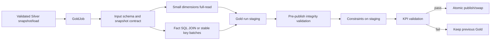

# Phase 4D - Gold Layer Impact and Execution Plan

## 1. Purpose

This document translates the approved Phase 4 Gold baseline into an implementation scope, impact analysis, task breakdown, and verifiable acceptance criteria.

Phase 4D covers:

1. Encapsulate Gold loading as an injectable job/service.
2. Keep full-read processing for currently small dimensions.
3. Build `fact_sales` with SQL-side staging or a stable-key batch fallback.
4. Run integrity, grain, key, measure, and KPI validation before publication.
5. Create and verify constraints on staging before publication.
6. Publish Gold atomically with safe retry and reconciliation behavior.
7. Run focused Gold regression tests and the appropriate repository regression suite.

Phase 4D does not redesign the Silver transformation, add unrelated Gold facts, or change approved business measures without a recorded decision.

## 2. Baseline and current implementation

### 2.1 Confirmed implementation surface

| Area | Current location | Current behavior | Phase 4D concern |
|---|---|---|---|
| Gold builders | `scripts/warehouse/postgres/gold/sales_gold_load.py` | Builds five dimensions and `fact_sales` with pandas | Preserve pure builders while moving orchestration and safety into a job/service |
| Gold orchestration | `scripts/warehouse/postgres/gold/sales_gold_load.py:run()` | Drops published Gold tables, reads all Silver tables, writes with `to_sql(..., if_exists="replace")`, then adds constraints | Destructive build can remove the last valid Gold version and expose partial output |
| Silver read | `_read()` in `sales_gold_load.py` | Uses full-table `pd.read_sql_query()` for all tables | Full-read is acceptable for small dimensions but not for a large fact input |
| Fact construction | `build_fact_sales()` | pandas many-to-one join of all detail and header rows | Need SQL-side or stable-key batch strategy with explicit grain and no silent row loss |
| Dimension construction | `build_dim_*()` | pandas selection and `drop_duplicates()` | Full-read remains allowed, but key uniqueness and deterministic selection must be validated |
| Constraints | `_add_constraints()` | Adds PK/FK to published tables after direct writes | Constraints must be created/verified on staging before publish |
| Destructive reset | `_reset_gold_tables()` | Drops six Gold tables with `CASCADE` before build | Must be removed from the canonical path; previous Gold must survive failures |
| KPI validation | `scripts/warehouse/postgres/gold/validate_sales_kpis.py` | Compares Gold metrics with Silver baseline after publication | Must become a pre-publish gate against the candidate Gold version |
| Gold schema | `scripts/warehouse/postgres/schema/03_create_gold_schema.sql` | Defines dimensions and fact tables, including PKs on initial DDL | Runtime `replace` can discard these constraints and create schema drift |
| Existing tests | `tests/test_sales_gold.py` | Covers dimension builders, fact calculations, grain, null handling, and output columns | Add service, staging, integrity, retry, publish-preservation, and rerun coverage |

### 2.2 Important schema contract observations

The implementation must reconcile the current code/schema contract before publication:

- `fact_sales` grain is one row per `sales_order_detail_id`.
- `dim_customer`, `dim_product`, `dim_date`, `dim_territory`, and `dim_salesperson` require stable primary keys.
- `salesperson_id` may be NULL for online orders; the FK policy must allow this explicitly while rejecting non-null orphan keys.
- The pandas product builder currently emits `class` and `style`, while the SQL schema names the corresponding columns `product_class` and `product_style`. This mismatch must be resolved by an explicit mapping or schema decision and covered by a contract test; it must not be left to `to_sql` inference.
- `created_at` and other database-managed metadata must not be lost when a staging table is published or when constraints are applied.

### 2.3 Falsifiable implementation hypothesis

The highest-risk Gold behavior is controlled by `_reset_gold_tables()`, the direct `to_sql(..., if_exists="replace")` loop, and `_add_constraints()` running after publication. A focused fake-publish test should prove that a build or validation exception leaves the previous published Gold version unchanged. A fact-grain test using duplicate or orphan keys should prove that invalid staging fails before any publish call. If either test reaches the published tables before failure, the publication boundary is still too late and must move into the staging/publish service.

### 2.4 Current public compatibility surface

The following builder functions and legacy entrypoint remain available during migration unless a separate compatibility decision is recorded:

- `build_dim_date(headers)`
- `build_dim_customer(customers)`
- `build_dim_product(products)`
- `build_dim_territory(territories)`
- `build_dim_salesperson(salespeople)`
- `build_fact_sales(details, headers)`
- `run()` as a legacy entrypoint delegating to the new Gold job/service

The compatibility wrapper must delegate only. Staging, retries, constraint management, validation, and publication logic belong to the new service and shared infrastructure.

## 3. Target architecture



### 3.1 Gold tables and ownership

| Target | Grain/key | Build strategy | Publication requirement |
|---|---|---|---|
| `gold.dim_date` | One row per calendar date; PK `date_id` | Full-read header date range is allowed | Complete date range and unique key before publish |
| `gold.dim_customer` | One row per `customer_id`; PK `customer_id` | Full-read dimension is allowed | Required columns, unique key, and customer references validated |
| `gold.dim_product` | One row per `product_id`; PK `product_id` | Full-read dimension is allowed | Output/schema naming aligned with DDL |
| `gold.dim_territory` | One row per `territory_id`; PK `territory_id` | Full-read dimension is allowed | Unique key and referenced territory keys validated |
| `gold.dim_salesperson` | One row per `salesperson_id`; PK `salesperson_id` | Full-read dimension is allowed | Nullable fact FK policy is explicit |
| `gold.fact_sales` | One row per `sales_order_detail_id`; PK `sales_order_detail_id` | Prefer PostgreSQL SQL JOIN/staging; stable key batches are fallback | Duplicate, orphan, null, measure, and KPI violations fail closed |

### 3.2 Component boundaries

| Component | Owns | Must not own |
|---|---|---|
| `GoldJob` or `SalesGoldJob` | Snapshot selection, table order, dimension/fact build coordination, result aggregation, and Gold policy | Environment parsing or duplicated retry/publish mechanics |
| Gold table/build specifications | Source tables, target tables, keys, required columns, data types, and FK map | Database transaction state and retry loops |
| Pure `build_dim_*`/`build_fact_sales` functions | Deterministic pandas transformation and measure calculation | Database writes, destructive DDL, retries, or publication |
| Fact staging builder | SQL-side join or stable-key batch extraction and writes | Changing published Gold tables |
| Gold validator | Schema, grain, key, null, reference, measure, and KPI checks | Silently dropping invalid rows or quarantining integrity failures |
| Constraint manager | PK/FK/type constraint creation and verification on staging | Applying constraints to an unvalidated published table |
| Shared staging/publish service | Run-specific identity, lifecycle, atomic swap, cleanup, and reconciliation | Gold-specific business rules |
| Pipeline runner | Call Gold only after valid Silver; block publication on Gold failure | Gold transformation internals |

### 3.3 Standard result contract

Every Gold table and stage result must use the shared result vocabulary and include at least:

```text
run_id, load_id/table_load_id, batch_id when applicable,
stage, source_table, target_table, status,
rows_read, rows_written, rows_rejected, attempt_count,
started_at, finished_at, error_type, error_message,
source_snapshot, staging_identity, published
```

Required terminal statuses:

| Status | Gold meaning |
|---|---|
| `SUCCESS` | Build, constraints, all validation, and publication pass |
| `FAILED` | Build, schema, grain, integrity, measure, KPI, constraint, or publication failure; previous Gold remains unchanged |
| `RETRYING` | A classified transient operation is being retried; not a terminal result |

Gold does not use quarantine as the default response to integrity or business-rule errors. Those errors fail the build and are investigated upstream or in the rule definition.

## 4. Impact analysis

### 4.1 Code impact

| Impacted area | Expected change | Risk | Mitigation/evidence |
|---|---|---|---|
| Gold loader | Extract `run()` orchestration into an injectable job/service | Existing scripts/tests may rely on a constructor-free entrypoint | Keep builder signatures and delegating `run()`; add compatibility test |
| Dimension reads | Keep full-read for small dimensions | Dimensions may grow beyond current assumptions | Record volume assumption and add a future threshold/strategy boundary |
| Fact read/build | Add SQL-side staging or stable `sales_order_detail_id` batches | Chunked pandas joins can lose header context or duplicate rows | Prefer database join; fallback must use stable key ranges and many-to-one validation |
| Fact grain | Enforce one row per `sales_order_detail_id` | Duplicate detail keys may be silently removed by current behavior | Duplicate key is a validation failure, never an implicit dedup rule |
| Gold publication | Replace drop-and-recreate flow with staging and atomic swap | Swap errors can leave backup/staging objects | Reuse shared publish/reconciliation lifecycle and test rollback/preservation |
| Constraints | Apply PK/FK and verify types on staging first | `to_sql(replace)` can erase DDL constraints or infer wrong types | Explicit DDL/type contract plus staging constraint integration tests |
| KPI validation | Adapt `validate_sales_kpis.py` to candidate staging/version | Validating after publication cannot prevent bad Gold exposure | Run KPI comparison before publish; preserve report rendering |
| Silver snapshot | Require one identifiable Silver snapshot/load | Mixing versions can produce inconsistent dimensions/facts | Snapshot identity is a required job input and audit field |
| Shared infrastructure | Reuse settings, identity, retry, audit, checkpoint, staging, and publish services | Gold-specific copies can diverge from Bronze/Silver behavior | Architecture review and shared contract tests |

### 4.2 Data and operational impact

- Gold is built in run-specific staging. The existing published Gold version remains available until every required table and validation has passed.
- Fact processing must use a deterministic source order based on `sales_order_detail_id`; offset/page-number checkpoints are prohibited.
- The fact join must preserve line-item grain and must not silently drop details with missing headers, products, customers, territories, or required dates.
- A nullable salesperson reference is valid only when the business rule permits online orders; a non-null orphan salesperson key fails validation.
- Gold integrity/business-rule errors are fail-closed. They are not converted into Gold quarantine rows.
- Constraint creation is part of staging validation, not a post-publication repair step.
- Retry applies only to transient database failures around an atomic unit. A failed deterministic build is not retried as a blind append.
- An unknown commit outcome must be reconciled by staging/audit/unique-key evidence before another fact batch attempt.
- The final result and audit must distinguish dimension rows, fact rows, rejected count (normally zero), duplicate/orphan counts, KPI status, and publication state.

### 4.3 Out of scope and decisions required

| Item | Treatment |
|---|---|
| Additional facts | `fact_customer_orders`, `fact_inventory`, and `fact_purchasing` are out of scope unless explicitly added to the Phase 4D task list. |
| Slowly changing dimensions | Not introduced in Phase 4D; current dimensions remain deterministic snapshots. |
| Gold row quarantine | Disabled by default; source conversion errors belong to Silver. |
| Dimension scaling | Full-read is accepted for current small dimensions; add a separate decision if volume thresholds are exceeded. |
| Product column naming | Must be resolved before production publish because builder and DDL currently differ. |
| KPI tolerance | Preserve the current independent Silver baseline and documented 2% tolerance unless a business approval changes it. |

## 5. Dependencies and execution order

```text
W1-W3 settings/shared contracts
    -> W4-W5 Bronze identity and publish evidence
        -> W6 Silver validated snapshot/load
            -> 7.1 Gold specs and injectable job
                -> 7.2 input/snapshot contracts
                    -> 7.3 dimensions and fact staging
                        -> 7.4 pre-publish integrity validation
                            -> 7.5 staging constraints
                                -> 7.6 KPI gate and atomic publish
                                    -> 7.7 retry/reconciliation and cleanup
                                        -> 7.8 Gold regression
```

Do not remove the destructive Gold flow until staging publication has a tested preservation boundary. Do not add retry before fact batch identity, transaction scope, and unknown-commit reconciliation are testable. Do not create FK constraints on candidate data before orphan checks are complete.

## 6. Task breakdown

### 6.1 Package Gold as a job/service

| ID | Task | Output | Acceptance criteria | Dependency | Status |
|---|---|---|---|---|---|
| 7.1.1 | Define Gold table specifications | Immutable specs for five dimensions and `fact_sales` | Each table has source, target, key, required columns, expected types, and FK metadata | W3/W6 | Not started |
| 7.1.2 | Create injectable Gold job | `SalesGoldJob` or equivalent with settings, reader, builders, validator, constraint manager, audit, and publisher | Job runs with fakes and returns standard results without a live database | 7.1.1 | Not started |
| 7.1.3 | Require Silver snapshot identity | Snapshot/load parameter and audit field | All Gold tables in one run use the same approved Silver snapshot/load | 7.1.2 | Not started |
| 7.1.4 | Preserve legacy builders and `run()` | Delegating compatibility surface | Existing builder tests and legacy callers remain functional; wrapper contains no new mechanics | 7.1.2 | Not started |

### 6.2 Dimension full-read strategy

| ID | Task | Output | Acceptance criteria | Dependency | Status |
|---|---|---|---|---|---|
| 7.2.1 | Read small dimensions fully | Injectable dimension reader | Full-read is limited to documented small dimensions and never used for the large fact path | 7.1.2 | Not started |
| 7.2.2 | Validate dimension input/output schema | Dimension contract validator | Missing Silver table/column or mismatched output type fails before staging publish | 7.2.1 | Not started |
| 7.2.3 | Make dimension selection deterministic | Stable key selection and explicit duplicate policy | Dimension keys are unique and the selected row is deterministic; no accidental `drop_duplicates()` behavior remains undocumented | 7.2.2 | Not started |
| 7.2.4 | Resolve product column contract | Builder/schema mapping and test | Product output columns match the Gold DDL and downstream consumers exactly | 7.2.2 | Not started |
| 7.2.5 | Build date dimension safely | Date-range builder contract | Empty or invalid date input returns a clear `FAILED` result; valid input produces a complete continuous date range | 7.2.1 | Not started |

### 6.3 Fact SQL staging or stable batch fallback

| ID | Task | Output | Acceptance criteria | Dependency | Status |
|---|---|---|---|---|---|
| 7.3.1 | Define fact grain contract | `sales_order_detail_id` uniqueness rule | Any duplicate fact key is a validation failure and is never silently removed | 7.1.1 | Not started |
| 7.3.2 | Implement SQL-side fact staging | PostgreSQL JOIN/INSERT staging path | Fact join executes in the database where practical and writes only to run-specific staging | 7.3.1 | Not started |
| 7.3.3 | Implement stable-key fallback | Batch reader ordered by `sales_order_detail_id` | Fallback does not use offsets; retries reuse the same key bounds and batch identity | 7.3.1 | Not started |
| 7.3.4 | Validate many-to-one header join | Join contract | Each detail maps to at most one header; missing required header is reported as an integrity failure | 7.3.2/7.3.3 | Not started |
| 7.3.5 | Calculate and validate measures | Fact measures and type contract | `discount_amount`, `net_sales`, quantities, prices, and date keys match the approved formulas and types | 7.3.2/7.3.3 | Not started |
| 7.3.6 | Commit atomic fact batches | Batch audit/checkpoint integration | Data commit precedes checkpoint; transient retry does not create duplicate fact rows | W5/7.3.3 | Not started |

### 6.4 Pre-publish integrity validation

| ID | Task | Output | Acceptance criteria | Dependency | Status |
|---|---|---|---|---|---|
| 7.4.1 | Validate staging schema and types | Candidate schema report | All target columns, names, nullability, and database types match the Gold contract | 7.2/7.3 | Not started |
| 7.4.2 | Validate dimensions and keys | Dimension quality report | Required dimension PKs are non-null and unique; duplicate keys fail closed | 7.2 | Not started |
| 7.4.3 | Validate fact grain and nulls | Fact quality report | One row per detail key; required fact fields are non-null; permitted nullable salesperson values are explicit | 7.3 | Not started |
| 7.4.4 | Validate referential integrity | Orphan-key report | Zero orphan references for date, customer, product, territory, and non-null salesperson keys before FK creation | 7.3/7.4.2 | Not started |
| 7.4.5 | Validate measures and business rules | Measure report | No invalid negative/overflow values or KPI rule violations under the approved contract | 7.3.5 | Not started |
| 7.4.6 | Adapt KPI validation to staging | Candidate KPI report | Gold candidate is compared with the independent Silver baseline before publication; current tolerance is 2% | 7.3/7.4.5 | Not started |

### 6.5 Constraints on staging

| ID | Task | Output | Acceptance criteria | Dependency | Status |
|---|---|---|---|---|---|
| 7.5.1 | Create staging DDL | Run-specific Gold staging tables | Staging tables have explicit column types and required metadata; no `replace` inference is relied upon | 7.1/7.3 | Not started |
| 7.5.2 | Add staging primary keys | PK DDL/verification | All dimension keys and `fact_sales.sales_order_detail_id` have valid PKs before publish | 7.4.2/7.4.3 | Not started |
| 7.5.3 | Add staging foreign keys | FK DDL/verification | FK creation succeeds only after orphan validation and preserves nullable salesperson semantics | 7.4.4 | Not started |
| 7.5.4 | Verify constraints and types | Constraint inspection report | Database metadata confirms PK/FK/type contract on every candidate table | 7.5.1-7.5.3 | Not started |
| 7.5.5 | Handle constraint failure | Fail-closed cleanup | Constraint failure does not alter published Gold and leaves staging recoverable or cleanable | 7.5.4 | Not started |

### 6.6 Atomic publication and retry safety

| ID | Task | Output | Acceptance criteria | Dependency | Status |
|---|---|---|---|---|---|
| 7.6.1 | Create run-specific staging identity | Gold staging manager integration | Published Gold is untouched during build; identifiers are validated and safe for SQL | W3/7.1 | Not started |
| 7.6.2 | Remove destructive reset from canonical flow | Refactored loader | No canonical execution drops published Gold before candidate build and validation complete | 7.6.1 | Not started |
| 7.6.3 | Publish/swap atomically | Gold publish service integration | All Gold tables become visible as one validated version, or the previous version remains active | 7.5/7.6.1 | Not started |
| 7.6.4 | Retry transient atomic units | Shared retry policy integration | Only classified transient database errors retry; retries retain run/table/batch identity | W5/7.3.6 | Not started |
| 7.6.5 | Reconcile unknown commits | Shared reconciliation integration | Client timeout after commit is checked against staging/audit/unique key before retry | 7.6.4 | Not started |
| 7.6.6 | Clean failed/abandoned staging | Lifecycle and retention behavior | Failed builds are not published and are marked/cleaned according to the shared staging policy | 7.6.3 | Not started |
| 7.6.7 | Record publication/version audit | Gold run/table audit | Result includes candidate version, previous version, counts, validation, constraints, publish state, and failure reason | 7.6.3 | Not started |

### 6.7 Gold regression tests

| ID | Task | Output | Acceptance criteria | Dependency | Status |
|---|---|---|---|---|---|
| 7.7.1 | Preserve builder regression tests | Existing `tests/test_sales_gold.py` coverage | Date, dimensions, fact grain, measures, nullable salesperson, and output columns remain covered | 7.2/7.3 | Not started |
| 7.7.2 | Add job contract tests | `tests/test_gold_job.py` | Injected fakes prove table order, snapshot propagation, standard results, and no live DB requirement | 7.1 | Not started |
| 7.7.3 | Add fact strategy tests | `tests/test_gold_fact_staging.py` | SQL path or fallback proves stable ordering, key bounds, many-to-one join, and no offset checkpoint | 7.3 | Not started |
| 7.7.4 | Add integrity/constraint tests | `tests/test_gold_validation.py` | Duplicate keys, null required keys, orphan references, type mismatch, and measure violations fail closed | 7.4/7.5 | Not started |
| 7.7.5 | Add publish preservation tests | `tests/test_gold_publish.py` | Build, validation, constraint, or publish failure leaves the old Gold version unchanged | 7.6 | Not started |
| 7.7.6 | Add retry/reconciliation tests | `tests/test_gold_retry.py` | Transient retry reuses identity; deterministic errors do not retry; unknown commit does not duplicate fact rows | 7.6.4/7.6.5 | Not started |
| 7.7.7 | Add rerun/idempotency tests | Gold integration or fake acceptance tests | Same Silver snapshot rerun produces deterministic dimensions/facts and one logical row per detail key | 7.3/7.6 | Not started |
| 7.7.8 | Add KPI gate tests | KPI validator tests | KPI mismatch blocks publish; an in-tolerance candidate can publish | 7.4.6/7.6.3 | Not started |
| 7.7.9 | Run Gold regression | Focused and repository suites | Focused Gold tests pass; unit tests are independent of external services; integration prerequisites are recorded | All prior tasks | Not started |

## 7. Verifiable acceptance criteria

### 7.1 Job and compatibility

- [ ] An injectable Gold job accepts settings and its database/build/validation/publish dependencies.
- [ ] The job uses one explicit Silver snapshot/load for all candidate Gold tables.
- [ ] Every attempted table returns the shared result contract with counts, timing, identity, error, staging, and publication fields.
- [ ] Existing `build_dim_*`, `build_fact_sales`, and legacy `run()` callers remain functional through delegation.
- [ ] The compatibility wrapper contains no new destructive, retry, or publication logic.

### 7.2 Dimensions and fact construction

- [ ] Full-read is used only for the documented small dimensions.
- [ ] Dimension keys are non-null, unique, deterministic, and aligned with the target DDL.
- [ ] Product builder output names and Gold schema names are reconciled and covered by a test.
- [ ] `fact_sales` has exactly one row per `sales_order_detail_id`; duplicate keys fail closed.
- [ ] Fact processing uses SQL-side staging or a stable `sales_order_detail_id` batch fallback.
- [ ] Fact processing does not use offset/page-number checkpoints.
- [ ] Fact measures and data types match the approved formulas and Gold schema.
- [ ] Missing required header/dimension references are reported as integrity failures, not silently dropped.

### 7.3 Pre-publish validation and constraints

- [ ] Candidate schema, column names, types, nullability, and required metadata are validated before publication.
- [ ] Duplicate PKs, required NULLs, orphan references, invalid measures, and grain violations block publication.
- [ ] Non-null salesperson references must resolve; NULL salesperson is accepted only under the documented online-order rule.
- [ ] KPI validation runs against candidate staging before publication and enforces the approved 2% tolerance.
- [ ] PK/FK constraints are created and verified on staging before the candidate is eligible for publish.
- [ ] Constraint creation failure leaves published Gold unchanged.

### 7.4 Atomic publish, retry, and rerun

- [ ] The canonical path never drops or replaces published Gold before candidate build and validation succeed.
- [ ] A failed build, validation, constraint operation, or publish leaves the previous Gold version unchanged.
- [ ] Successful publication atomically promotes the complete validated version and preserves its constraints.
- [ ] Only classified transient database errors are retried.
- [ ] Retry preserves run/table/batch identity and uses the same atomic unit.
- [ ] Unknown commit outcomes are reconciled before another write attempt.
- [ ] Failed or abandoned staging is marked/cleaned according to the shared lifecycle policy.
- [ ] Rerunning the same Silver snapshot is deterministic and does not create duplicate fact rows.

### 7.5 Observability and pipeline gate

- [ ] Audit records include snapshot, run/table/batch identity, source/target, counts, attempts, validation, constraint, publish, and error outcomes.
- [ ] Structured logs include applicable stage/table/batch/status fields without secrets or full raw payloads.
- [ ] Gold failure or KPI validation failure prevents downstream success and is visible to the pipeline result.
- [ ] A machine-readable summary distinguishes dimension counts, fact counts, orphan/duplicate counts, KPI status, and publication state.

## 8. Test matrix and commands

### 8.1 Required scenarios

| Scenario | Test type | Expected result |
|---|---|---|
| Valid dimension builder | Unit | Existing dimension output and key behavior remain correct |
| Valid fact builder | Unit | Measures, date key, types, and line-item grain are correct |
| Product schema mapping | Unit/integration | Builder columns match Gold DDL exactly |
| Empty/invalid date range | Unit | Clear failed result; no partial publication |
| Duplicate fact key | Unit/integration | Validation fails; no silent dedup or publish |
| Missing required reference | Unit/integration | Orphan report fails before FK/publish |
| Nullable salesperson | Unit/integration | NULL is allowed only under explicit policy; non-null orphan fails |
| Large fact input | Unit/integration | SQL staging or stable key batches avoid full fact read |
| Stable fact ordering | Unit | Same snapshot produces same key bounds and batch identity |
| Transient fact write failure | Unit | Same batch retries with bounded attempts and no duplicate |
| Unknown commit | Integration | Reconciliation detects committed batch before retry |
| Constraint failure | Integration | Old Gold remains unchanged |
| KPI mismatch | Unit/integration | Candidate is rejected before publish |
| Build/publish failure | Unit/integration | Existing Gold remains unchanged |
| Successful atomic publish | Integration | Complete constrained candidate becomes published |
| Same snapshot rerun | Integration | Deterministic output and one fact row per detail key |
| Secret/redaction behavior | Unit | Credentials and raw payload do not appear in logs/reports |

### 8.2 Suggested commands

Run from the repository root:

```powershell
python -m pytest tests/test_sales_gold.py -q
python -m pytest tests/test_sales_gold.py tests/test_ingestion_models.py tests/test_retry_policy.py tests/test_staging_manager.py tests/test_checkpoint_manager.py tests/test_audit_service.py -q
python -m pytest -m "not integration" -q
python -m pytest -q
```

Suggested new focused test files:

```text
tests/test_gold_job.py
tests/test_gold_fact_staging.py
tests/test_gold_validation.py
tests/test_gold_publish.py
tests/test_gold_retry.py
```

Integration tests must be marked with the repository integration marker and must distinguish unavailable PostgreSQL/SQL Server prerequisites from application failures.

## 9. Definition of Done for Phase 4D

Phase 4D is complete only when all applicable items below have implementation and test evidence:

- [ ] Gold is callable through an injectable job/service and the legacy entrypoint delegates to it.
- [ ] Small dimensions use documented full-read behavior with explicit schema/key validation.
- [ ] `fact_sales` uses SQL-side staging or stable key batches and preserves `sales_order_detail_id` grain.
- [ ] Fact duplicate, orphan, null, type, measure, and KPI violations fail closed.
- [ ] Gold candidate tables are built in run-specific staging; published Gold is untouched during the build.
- [ ] PK/FK constraints and data types are verified on staging before publication.
- [ ] Gold publication is atomic and preserves the previous version after any failure.
- [ ] Retry is limited to transient errors, preserves identity, and reconciles unknown commits.
- [ ] Same-snapshot rerun is deterministic and idempotent.
- [ ] Failed/abandoned staging cleanup is tested.
- [ ] Focused Gold unit tests pass without external services.
- [ ] Integration tests pass when prerequisites are available, or blockers are clearly recorded.
- [ ] Structured audit/log/report output is complete and redacted.
- [ ] README/runbook and the Phase 4 master checklist match the implemented runtime.

Production DoD must not be inferred from the existing pandas builder tests alone. Staging transaction, constraint, integrity, KPI gate, retry/reconciliation, rerun, and publish-preservation evidence are required.

## 10. Risks and mitigations

| Risk | Impact | Mitigation |
|---|---|---|
| Published Gold is dropped before build | Dashboard availability loss | Run-specific staging and atomic swap only after all validation |
| Fact full-read causes memory pressure | Runtime failure or resource exhaustion | Prefer SQL-side join/staging; use stable key batches as fallback |
| Duplicate detail key is silently removed | Incorrect sales totals and grain | Treat duplicate `sales_order_detail_id` as a failed validation |
| Orphan key is discovered only during FK creation | Late failure after destructive changes | Validate references before creating constraints or publishing |
| `to_sql(replace)` removes constraints | Schema contract drift | Explicit staging DDL and constraint inspection |
| Unknown commit is retried blindly | Duplicate fact rows | Reconcile staging/audit/unique-key evidence before retry |
| Dimension builder/schema mismatch | Runtime load or downstream query failure | Resolve `class`/`style` naming contract with a focused schema test |
| KPI validation runs after publish | Invalid metrics become visible | Compare candidate staging with independent Silver baseline before publish |
| Same snapshot uses mixed source versions | Inconsistent dimensions/facts | Require and audit one Silver snapshot/load identity |
| Legacy API breaks | Existing tests/scripts fail | Delegating wrapper and compatibility regression tests |

## 11. Evidence log

Update this table after each task. A task may be marked `Done` only when implementation, focused test, and relevant regression evidence are recorded.

| Date | Task | Files/symbols | Validation command | Result | Status |
|---|---|---|---|---|---|
| 2026-09-04 | Create Phase 4D Gold implementation scope | `docs/ToDoCheckList/Phase_4_Review&Enhance_Code/phase4d_goldlayer_execution.md` | Markdown review | Document created; implementation not started | Done |
| 2026-09-04 | Baseline current Gold behavior | `sales_gold_load.py`, `03_create_gold_schema.sql`, `validate_sales_kpis.py`, `tests/test_sales_gold.py` | Source/test inspection | Full Silver reads, destructive reset, direct replace, post-write constraints, and standalone KPI validation confirmed | Done |
| TBD | Package Gold as injectable job/service | TBD | TBD | TBD | Not started |
| TBD | Implement dimension and fact staging | TBD | TBD | TBD | Not started |
| TBD | Implement pre-publish integrity/KPI validation | TBD | TBD | TBD | Not started |
| TBD | Implement staging constraints and atomic publish | TBD | TBD | TBD | Not started |
| TBD | Implement retry/reconciliation and rerun safety | TBD | TBD | TBD | Not started |
| TBD | Run focused Gold and repository regression tests | TBD | TBD | TBD | Not started |

## 12. Related documents

- `docs/internal/phase4_review_enhance_spec.md`
- `docs/internal/phase4_enhancement_execution_plan_spec.md`
- `docs/ToDoCheckList/Phase_4_Review&Enhance_Code/phase4a_foundation_execution.md`
- `docs/ToDoCheckList/Phase_4_Review&Enhance_Code/phase4b_bronzelayer_execution.md`
- `docs/ToDoCheckList/Phase_4_Review&Enhance_Code/phase4c_silverlayer_execution.md`
- `src/shared/ingestion/ingestion_models.py`
- `src/shared/ingestion/staging_manager.py`
- `src/shared/ingestion/postgres_publish_service.py`
- `src/shared/ingestion/retry_policy.py`
- `src/shared/ingestion/checkpoint_manager.py`
- `src/shared/ingestion/audit_service.py`
- `scripts/warehouse/postgres/gold/sales_gold_load.py`
- `scripts/warehouse/postgres/gold/validate_sales_kpis.py`
- `scripts/warehouse/postgres/schema/03_create_gold_schema.sql`
- `tests/test_sales_gold.py`
