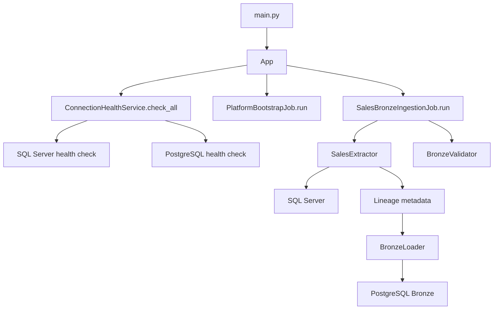
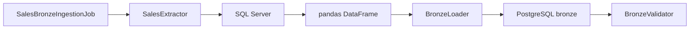
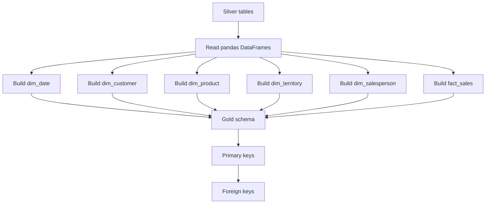

Tôi đã đối chiếu lại các file nền tảng và đặc biệt xác nhận một điểm dễ gây nhầm: repository mô tả pipeline “end-to-end”, nhưng runtime hiện tại chưa phải một command chạy Bronze → Silver → Gold. Tôi sẽ trình bày workflow theo đúng code đang chạy, sau đó đi xuống từng hàm/lớp và chỉ ra ranh giới giữa code thực thi, validation và tài liệu kế hoạch.

# 1. Bức tranh tổng thể

Project hiện tại là một nền tảng phân tích dữ liệu AdventureWorks theo mô hình:

```text
SQL Server AdventureWorks2012
              |
              v
        Bronze - raw data
              |
              v
        Silver - clean data
              |
              v
        Gold - star schema
              |
              v
        Power BI / dashboard
```

Tuy nhiên, workflow hiện tại được chia thành hai loại:

```text
main.py
  -> health check
  -> bootstrap
  -> Bronze ingestion

Silver và Gold:
  -> chạy bằng script riêng
  -> chưa được gọi tự động từ main.py
```

Đây là điểm quan trọng nhất khi đọc code hiện tại.

---

# 2. Cấu trúc code hiện tại

## `src/`

Đây là application/library code chính.

```text
src/
├── app/
│   └── app.py
├── shared/
│   ├── connectors/
│   │   ├── base_connector.py
│   │   ├── sql_server_connector.py
│   │   └── postgres_connector.py
│   └── services/
│       └── connection_health_service.py
├── features/
│   └── Sales_Performance/
│       ├── domain/
│       │   └── bronze/
│       │       ├── sales_extractor.py
│       │       ├── bronze_loader.py
│       │       └── bronze_validator.py
│       │       └── jobs/
│       │           └── sales_bronze_ingestion_job.py
├── jobs/
│   └── platform_bootstrap.py
├── services/
│   └── __init__.py
├── domain/
│   └── __init__.py
└── core/
    ├── config.py
    └── app/
        └── app.py
```

## `scripts/`

Đây là các operational script chạy riêng:

```text
scripts/
├── source/
│   └── sqlserver/profiling/source_profile.py
├── ingestion/
│   └── bronze/
│       ├── bronze_ingest.py
│       └── sales_bronze_load.py
├── transformation/
│   └── silver/
│       ├── sales_silver_clean.py
│       └── validate_silver.py
└── warehouse/
    └── postgres/
        ├── init/init-db.sql
        └── gold/
            ├── sales_gold_load.py
            └── validate_sales_kpis.py
```

---

# 3. Workflow runtime chính

## 3.1. Khi chạy `main.py`

File [main.py](../../main.py) chỉ có nhiệm vụ tạo `App` và gọi `run()`:

```text
main.py
  |
  v
App()
  |
  v
App.run()
```

`App` được định nghĩa trong [src/app/app.py](../../src/app/app.py).

Workflow:



`main.py` hiện **không chạy**:

```text
sales_silver_clean.py
sales_gold_load.py
validate_silver.py
validate_sales_kpis.py
```

---

# 4. Chi tiết `App`

File: [src/app/app.py](../../src/app/app.py)

## Constructor

```python
def __init__(self, bootstrap_job=None, health_service=None, bronze_job=None):
```

Constructor nhận ba dependency:

- `bootstrap_job`
- `health_service`
- `bronze_job`

Nếu caller không truyền dependency, nó tự tạo:

```python
self.bootstrap_job = bootstrap_job or PlatformBootstrapJob()
self.health_service = health_service or ConnectionHealthService()
self.bronze_job = bronze_job or SalesBronzeIngestionJob()
```

Cách này giúp test có thể truyền fake/mock job vào.

### Vai trò của `PlatformBootstrapJob`

`PlatformBootstrapJob` là job khởi tạo nền tảng trước khi chạy ETL. Về ý tưởng, nó có thể chịu trách nhiệm:

```text
Tạo schema Bronze/Silver/Gold
Kiểm tra database đã sẵn sàng
Tạo metadata tables
Kiểm tra cấu hình môi trường
```

Nhưng trong code hiện tại, nó mới là placeholder. Method `run()` chỉ trả về:

```python
{
    "status": "ok",
    "message": "bootstrap job executed"
}
```

Nó chưa thực sự tạo schema hay chạy SQL. Schema hiện được tạo bởi `init-db.sql` khi PostgreSQL Docker khởi tạo.

### Có cần truyền đủ ba tham số khi tạo `App` không?

Không. `bootstrap_job`, `health_service` và `bronze_job` đều là optional dependency injection:

```python
def __init__(self, bootstrap_job=None, health_service=None, bronze_job=None):
```

Khi chạy bình thường, chỉ cần:

```python
app = App()
result = app.run()
```

`App` sẽ tự tạo ba implementation mặc định:

```python
self.bootstrap_job = bootstrap_job or PlatformBootstrapJob()
self.health_service = health_service or ConnectionHealthService()
self.bronze_job = bronze_job or SalesBronzeIngestionJob()
```

Ba dependency chỉ được truyền vào khi test hoặc khi muốn thay thế implementation:

```python
app = App(
    bootstrap_job=fake_bootstrap,
    health_service=fake_health,
    bronze_job=fake_bronze,
)
```

### Thứ tự thực thi trong `App.run()`

```text
App.run()
  |
  |-- 1. health_service.check_all()
  |      -> kiểm tra SQL Server và PostgreSQL
  |
  |-- 2. bootstrap_job.run()
  |      -> khởi tạo platform
  |
  |-- 3. bronze_job.run(mode="full")
  |      -> extract và load Bronze
  |
  |-- 4. tổng hợp status
  |
  +-- return kết quả
```

Nếu health check bị `degraded`, code hiện tại vẫn tiếp tục chạy bootstrap và Bronze. Health check chỉ được dùng để tính status cuối cùng, chưa phải cơ chế chặn pipeline.

## `run()`

Thứ tự thực thi:

```python
self._running = True
```

Đánh dấu application bắt đầu chạy.

```python
health_result = self.health_service.check_all()
```

Kiểm tra:

- SQL Server
- PostgreSQL

```python
bootstrap_result = self.bootstrap_job.run()
```

Chạy platform bootstrap. Hiện tại bootstrap chỉ trả về thông báo thành công giả lập.

```python
bronze_result = self.bronze_job.run(mode="full")
```

Chạy Bronze ingestion toàn phần.

Sau đó code kiểm tra:

```python
bronze_ok = all(
    item.get("status") == "SUCCESS"
    for item in bronze_result.values()
)
```

Nếu toàn bộ bảng Bronze thành công và health check tốt:

```python
status = "ok"
```

Ngược lại:

```python
status = "degraded"
```

Kết quả trả về có dạng:

```python
{
    "status": "ok",
    "health": {...},
    "bootstrap": {...},
    "bronze": {...}
}
```

---

# 5. Shared connectors

## 5.1. `BaseConnector`

File: [base_connector.py](../../src/shared/connectors/base_connector.py)

Đây là abstract-style base class.

```python
class BaseConnector:
```

Lưu connection:

```python
self.connection = None
```

Method `connect()`:

```python
raise NotImplementedError(...)
```

Các connector con bắt buộc phải tự triển khai.

Context manager:

```python
with SQLServerConnector() as sql_conn:
```

sẽ gọi:

```text
__enter__()
  -> connect()

__exit__()
  -> disconnect()
```

Mục đích là đảm bảo connection được đóng sau khi dùng.

---

## 5.2. SQL Server connector

File: [sql_server_connector.py](../../src/shared/connectors/sql_server_connector.py)

Connector này dùng `pyodbc`.

Các thông tin lấy từ environment:

```text
SQL_SERVER_HOST
SQL_SERVER_PORT
SQL_SERVER_DATABASE
SQL_SERVER_USERNAME
SQL_SERVER_PASSWORD
SQL_SERVER_DRIVER
```

Database mặc định:

```text
AdventureWorks2012
```

Authentication mặc định:

```text
Windows Authentication
```

Connection string Windows Authentication:

```text
Driver={...};
Server=...;
Database=...;
Trusted_Connection=yes;
```

Method `execute_query()`:

1. Kiểm tra connection tồn tại.
2. Tạo cursor.
3. Execute SQL.
4. Fetch result.
5. Đóng cursor.

---

## 5.3. PostgreSQL connector

File: [postgres_connector.py](../../src/shared/connectors/postgres_connector.py)

Connector này dùng `psycopg2`.

Thông tin mặc định:

```text
host: localhost
port: 5432
database: adventureworks_warehouse
username: postgres
password: postgres
```

Method `execute_query()`:

1. Kiểm tra connection.
2. Tạo cursor.
3. Execute SQL.
4. Commit transaction.
5. Trả cursor.

Method `fetch_results()`:

1. Gọi `execute_query()`.
2. Fetch tất cả rows.
3. Đóng cursor.
4. Trả dữ liệu.

---

# 6. Health check workflow

File: [connection_health_service.py](../../src/shared/services/connection_health_service.py)

`ConnectionHealthService` kiểm tra từng connector qua `_check_connector()`.

Flow:

```text
_create connector
       |
       v
connector.connect()
       |
       +-- True  -> status ok
       |
       +-- False -> status failed
       |
       v
connector.disconnect()
```

`check_all()` chạy hai check:

```python
[
    self._check_connector("sql_server", SQLServerConnector()),
    self._check_connector("postgres", PostgreSQLConnector()),
]
```

Kết quả tổng thể:

```python
overall_status = "ok"
```

chỉ khi cả hai connection đều thành công.

Nếu một connection lỗi:

```python
overall_status = "degraded"
```

Ví dụ:

```python
{
    "status": "degraded",
    "connections": [
        {
            "name": "sql_server",
            "status": "ok"
        },
        {
            "name": "postgres",
            "status": "failed"
        }
    ]
}
```

---

# 7. Bronze workflow

## 7.1. Bronze job

File: [sales_bronze_ingestion_job.py](../../src/features/Sales_Performance/jobs/sales_bronze_ingestion_job.py)

Đây là orchestration layer cho Bronze.

Nó tạo ba object:

```python
self.extractor = SalesExtractor()
self.loader = BronzeLoader()
self.validator = BronzeValidator()
```

Workflow:



## Danh sách source table

Job hiện extract 7 bảng:

| SQL Server source | PostgreSQL Bronze target |
|---|---|
| `Sales.SalesOrderHeader` | `bronze.sales_order_header` |
| `Sales.SalesOrderDetail` | `bronze.sales_order_detail` |
| `Sales.Customer` | `bronze.customer` |
| `Sales.SalesTerritory` | `bronze.sales_territory` |
| `Sales.SalesPerson` | `bronze.sales_person` |
| `Production.Product` | `bronze.product` |
| `Person.Person` | `bronze.person` |

Mỗi entry có dạng:

```python
(
    source_schema,
    source_table,
    bronze_table
)
```

Job loop qua từng bảng:

```python
for source_schema, source_table, bronze_table in extraction_map:
```

Sau đó:

```python
df = self.extractor.extract_table(...)
```

Extract dữ liệu từ SQL Server.

```python
source_count = len(df)
```

Đếm số dòng nguồn.

```python
target_count, success = self.loader.load(...)
```

Ghi DataFrame vào PostgreSQL.

Nếu mode là `full`:

```python
if_exists="replace"
```

Nếu mode là `incremental`:

```python
if_exists="append"
```

Sau đó validate row count:

```python
validation_ok = self.validator.validate(...)
```

Kết quả cho mỗi bảng:

```python
{
    "source_table": "...",
    "source_count": ...,
    "target_count": ...,
    "validation_passed": True,
    "status": "SUCCESS"
}
```

---

## 7.2. Extractor

File: [sales_extractor.py](../../src/features/Sales_Performance/domain/bronze/sales_extractor.py)

Extractor mở SQL Server:

```python
with SQLServerConnector() as sql_conn:
```

Tạo tên bảng:

```python
full_table_name = f"{source_schema}.{source_table}"
```

Ví dụ:

```text
Sales.SalesOrderHeader
```

Chạy query:

```sql
SELECT * FROM Sales.SalesOrderHeader
```

Lấy column names từ cursor description.

Lấy toàn bộ rows.

Chuyển SQL Server row objects thành tuple:

```python
normalized_rows = [tuple(row) for row in rows]
```

Tạo pandas DataFrame:

```python
df = pd.DataFrame(normalized_rows, columns=columns)
```

Sau đó thêm lineage metadata:

```text
_source_system
_source_table
_load_date
```

Ví dụ:

```text
_source_system = AdventureWorks2012
_source_table = Sales.SalesOrderHeader
_load_date = current datetime
```

Cuối cùng tạo `_record_hash`.

Hash được tính từ dữ liệu nghiệp vụ, không bao gồm metadata:

```text
business columns
  -> JSON
  -> SHA-256
  -> _record_hash
```

Mục đích của hash:

- nhận diện record
- hỗ trợ lineage
- phát hiện duplicate hoặc thay đổi dữ liệu sau này

---

## 7.3. Bronze loader

File: [bronze_loader.py](../../src/features/Sales_Performance/domain/bronze/bronze_loader.py)

Loader tạo SQLAlchemy engine dựa trên connection PostgreSQL hiện tại.

Sau đó:

```python
df.to_sql(
    target_table,
    engine,
    schema=target_schema,
    if_exists=if_exists,
    index=False,
    method="multi",
    chunksize=1000,
)
```

Ý nghĩa:

- `schema="bronze"`: ghi vào Bronze schema.
- `if_exists="replace"`: xóa bảng cũ và tạo lại.
- `if_exists="append"`: thêm dữ liệu.
- `method="multi"`: insert nhiều rows mỗi statement.
- `chunksize=1000`: chia batch insert.

---

## 7.4. Bronze validator

File: [bronze_validator.py](../../src/features/Sales_Performance/domain/bronze/bronze_validator.py)

Validation chính là count parity:

```text
source_count == target_count
```

Nếu khác nhau thì raise `ValueError`.

`validate_table()` có thêm các kiểm tra:

- count match
- lineage columns
- critical columns
- null tolerance

Các lineage field bắt buộc:

```text
_source_system
_source_table
_load_date
_record_hash
```

---

# 8. Silver workflow

File chính: [sales_silver_clean.py](../../scripts/transformation/silver/sales_silver_clean.py)

Silver không chạy từ `App`. Nó là script độc lập.

Chạy bằng:

```powershell
python -m scripts.transformation.silver.sales_silver_clean
```

## Input/output mapping

| Bronze input | Silver output |
|---|---|
| `bronze.sales_order_header` | `silver.sales_order_header_clean` |
| `bronze.sales_order_detail` | `silver.sales_order_detail_clean` |
| `bronze.customer` | `silver.customer_clean` |
| `bronze.sales_territory` | `silver.sales_territory_clean` |
| `bronze.sales_person` | `silver.sales_person_clean` |
| `bronze.product` | `silver.product_clean` |

`bronze.person` được đọc thêm để enrich tên salesperson, nhưng không tạo `silver.person_clean`.

### Vì sao cần đọc `bronze.person`?

Trong AdventureWorks, thông tin salesperson được tách thành hai bảng:

```text
Sales.SalesPerson
  -> BusinessEntityID
  -> thông tin doanh số, quota, commission

Person.Person
  -> BusinessEntityID
  -> FirstName, LastName
```

Hai bảng liên kết bằng:

```text
SalesPerson.BusinessEntityID = Person.BusinessEntityID
```

Vì vậy `bronze.person` được đọc để lấy tên thật của salesperson. Khi xử lý `sales_person`, `person_frame` được truyền vào `clean_sales_person()` để tạo:

```text
salesperson_name = first_name + last_name
```

Ví dụ:

```text
BusinessEntityID = 274
FirstName = Linda
LastName = Mitchell
salesperson_name = Linda Mitchell
```

Nếu không có `bronze.person`, hệ thống chỉ có thể fallback sang ID:

```text
salesperson_name = 274
```

Person được đọc một lần trước vòng lặp để tái sử dụng DataFrame, tránh query lại bảng nhiều lần. Nếu bảng không tồn tại, code tiếp tục với fallback name và in warning.

Lưu ý: hiện tại Person chỉ được dùng để enrich salesperson. `clean_customer()` chưa join với `bronze.person`; `customer_name` hiện được tạo từ `account_number`.

---

## Các helper function

### `_warehouse_engine()`

Tạo SQLAlchemy engine sử dụng PostgreSQL connection hiện tại.

### `_read_bronze()`

Đọc một bảng Bronze:

```sql
SELECT * FROM bronze."table_name"
```

và trả về pandas DataFrame.

### `_rename_columns()`

Đổi tên các cột SQL Server style sang snake_case.

Ví dụ:

```text
SalesOrderID -> sales_order_id
OrderDate -> order_date
TotalDue -> total_due
```

### `_deduplicate()`

```python
frame.drop_duplicates(subset=[key], keep="last")
```

Giữ row cuối cùng cho mỗi business key.

Ví dụ:

```text
sales_order_id = 100
sales_order_id = 100
```

chỉ giữ record cuối.

### `_select_columns()`

Chỉ giữ những columns được định nghĩa cho Silver schema.

---

## Header cleaning

Function:

```python
clean_sales_order_header()
```

Thực hiện:

1. Rename columns.
2. Convert ngày:
   - `order_date`
   - `due_date`
   - `ship_date`
3. Convert số:
   - `subtotal`
   - `tax_amt`
   - `freight`
   - `total_due`
4. Deduplicate theo `sales_order_id`.
5. Chọn schema output.

---

## Detail cleaning

Function:

```python
clean_sales_order_detail()
```

Thực hiện:

- rename columns
- convert `order_qty` thành nullable integer
- convert price fields thành numeric
- deduplicate theo `sales_order_detail_id`

Output giữ grain line item:

```text
một row = một sales order detail
```

---

## Customer cleaning

Function:

```python
clean_customer()
```

Thực hiện:

- rename customer fields
- tạo `customer_name` từ `account_number`
- deduplicate theo `customer_id`

Lưu ý: hiện tại `customer_name` đang sử dụng `account_number`, không phải tên thật từ `Person.Person`.

---

## Sales territory cleaning

Function:

```python
clean_sales_territory()
```

Thực hiện:

- rename fields
- trim `territory_name`
- deduplicate theo `territory_id`

---

## Salesperson cleaning

Function:

```python
clean_sales_person()
```

Thực hiện:

1. Đổi `BusinessEntityID` thành `business_entity_id`.
2. Tạo `salesperson_id`.
3. Nếu có `person_frame`, join với Bronze Person.
4. Tạo:

```text
salesperson_name = first_name + last_name
```

5. Nếu không có Person data, fallback sang ID.
6. Deduplicate theo `salesperson_id`.

Workflow:

```text
bronze.sales_person
        +
bronze.person
        |
        v
silver.sales_person_clean
```

---

## Product cleaning

Function:

```python
clean_product()
```

Thực hiện:

- rename product fields
- convert cost/price sang numeric
- trim product name
- tạo `is_discontinued`
- deduplicate theo `product_id`

Output không giữ `discontinued_date`, chỉ giữ flag:

```text
is_discontinued = True/False
```

---

## Silver `run()`

Workflow:

```text
connect PostgreSQL
  -> đọc bronze.person nếu có
  -> loop qua SILVER_TABLES
  -> đọc Bronze
  -> gọi cleaner tương ứng
  -> ghi Silver bằng to_sql(replace)
  -> trả row counts
```

Kết quả:

```python
{
    "sales_order_header_clean": {
        "source_count": ...,
        "target_count": ...
    }
}
```

---

# 9. Silver validation

File: [validate_silver.py](../../scripts/transformation/silver/validate_silver.py)

Script này kiểm tra:

## Table-level checks

- row count không bị tăng bất thường
- duplicate business keys
- null ở critical columns

Hiện tại logic cho phép:

```text
silver_count <= bronze_count
```

vì Silver có deduplication.

## Join integrity checks

Các quan hệ được kiểm tra:

```text
detail -> header
detail -> product
header -> customer
header -> territory
header -> salesperson
```

Mục tiêu là không có orphan records.

Ví dụ:

```sql
LEFT JOIN silver.sales_order_header_clean header
  ON detail.sales_order_id = header.sales_order_id
WHERE header.sales_order_id IS NULL
```

Nếu query trả về 0 rows orphan thì join pass.

---

# 10. Gold workflow

File: [sales_gold_load.py](../../scripts/warehouse/postgres/gold/sales_gold_load.py)

Chạy bằng:

```powershell
python -m scripts.warehouse.postgres.gold.sales_gold_load
```

Workflow:



## Gold tables

```text
gold.dim_date
gold.dim_customer
gold.dim_product
gold.dim_territory
gold.dim_salesperson
gold.fact_sales
```

---

## `build_dim_date()`

Input:

```text
silver.sales_order_header_clean
```

Tìm ngày nhỏ nhất và lớn nhất.

Sau đó tạo continuous date range:

```text
min order date -> max order date
```

Mỗi ngày tạo:

- `date_id`
- `full_date`
- `year_number`
- `quarter_number`
- `month_number`
- `month_name`
- `day_number`
- `is_weekend`

`date_id` có format:

```text
YYYYMMDD
```

Ví dụ:

```text
20110531
```

### Vì sao `date_id` dùng công thức `YYYYMMDD`?

Code sử dụng:

```python
value.year * 10000 + value.month * 100 + value.day
```

Ví dụ với ngày `2011-05-31`:

```text
2011 * 10000 = 20,110,000
5 * 100       = 500
31            = 31
--------------------
date_id       = 20,110,531
```

Kết quả là số nguyên `20110531`, có format:

```text
YYYYMMDD
```

Ý nghĩa của công thức:

- `year * 10000`: đưa năm vào bốn chữ số đầu.
- `month * 100`: đưa tháng vào hai chữ số tiếp theo.
- `day`: đưa ngày vào hai chữ số cuối.

Key dạng này có một số lợi ích:

- Dễ dùng làm key trong `dim_date` và foreign key trong `fact_sales`.
- Dễ đọc hơn một số surrogate key ngẫu nhiên.
- Sort số theo thứ tự tăng dần cũng chính là sort theo thời gian.
- Không phụ thuộc vào format chuỗi như `MM/DD/YYYY` hoặc `DD/MM/YYYY`.

Code cũng tạo toàn bộ ngày liên tục từ ngày nhỏ nhất đến ngày lớn nhất:

```python
values = pd.date_range(start=start_date, end=end_date, freq="D")
```

Ví dụ nếu dữ liệu chỉ có `2011-05-31` và `2011-06-02`, `dim_date` vẫn có thêm `2011-06-01`. Điều này hữu ích cho báo cáo theo thời gian liên tục, kể cả những ngày không phát sinh đơn hàng.

---

## Dimension builders

Các function dimension đều:

1. Chọn các cột cần thiết.
2. Deduplicate theo key.

Ví dụ:

```python
build_dim_customer()
```

giữ:

```text
customer_id
customer_name
person_id
store_id
territory_id
account_number
```

`build_dim_product()` tạo product dimension.

`build_dim_territory()` tạo territory dimension.

`build_dim_salesperson()` tạo salesperson dimension.

---

## `build_fact_sales()`

Đây là phần quan trọng nhất của Gold.

Input:

- Silver order detail
- Silver order header

Join:

```text
detail.sales_order_id
        =
header.sales_order_id
```

Relationship được kiểm soát bằng:

```python
validate="many_to_one"
```

Nghĩa là:

- một header có thể có nhiều detail
- mỗi detail chỉ được match tối đa một header

Fact giữ grain:

```text
1 row = 1 sales order line item
```

Các field tính toán:

```text
gross_total = order_qty * unit_price
discount_amount = gross_total - line_total
net_sales = line_total
```

`order_date_id` cũng được tạo theo format:

```text
YYYYMMDD
```

Output chính:

```text
sales_order_id
sales_order_detail_id
order_date_id
customer_id
product_id
territory_id
salesperson_id
order_qty
unit_price
discount_amount
line_total
net_sales
```

---

## Reset và constraint

Trước khi load Gold:

```python
DROP TABLE IF EXISTS gold.fact_sales CASCADE
```

và các dimension cũ cũng bị drop.

Sau đó DataFrame được ghi bằng:

```python
to_sql(..., if_exists="replace")
```

Cuối cùng thêm:

- primary key cho dimensions
- primary key cho fact
- foreign keys từ fact tới dimensions

---

# 11. Gold KPI validation

File: [validate_sales_kpis.py](../../scripts/warehouse/postgres/gold/validate_sales_kpis.py)

Script lấy KPI từ hai nguồn:

```text
Gold fact_sales
Silver detail + header baseline
```

Các KPI:

- total revenue
- total orders
- total line items
- total units
- average order value
- average item price
- discount amount
- discount rate
- customer count

Sau đó tính variance:

```text
abs(actual - expected) / abs(expected)
```

KPI được xem là pass nếu variance <= 2%.

Mục tiêu là kiểm tra Gold có giữ đúng business metrics so với Silver baseline hay không.

---

# 12. Docker database initialization

File: [docker-compose.yml](../../docker-compose.yml)

Docker chạy PostgreSQL 15.

SQL init hiện được mount từ:

[scripts/warehouse/postgres/init/init-db.sql](../../scripts/warehouse/postgres/init/init-db.sql)

Script tạo ba schema:

```sql
bronze
silver
gold
```

Ngoài ra tạo metadata tables:

```text
bronze.schema_version
bronze.load_audit
bronze.column_metadata
```

Lưu ý: PostgreSQL init scripts chỉ chạy tự động khi database volume được khởi tạo lần đầu. Nếu volume cũ đã tồn tại, sửa file SQL không tự động chạy lại.

---

# 13. Test workflow

Các test hiện tại chia thành:

```text
test_architecture_contract.py
  -> kiểm tra App, bootstrap, health service

test_bronze_ingestion_job.py
  -> kiểm tra Bronze job, validator, extractor, lineage hash

test_sales_silver.py
  -> kiểm tra rename, type conversion, deduplication

test_sales_gold.py
  -> kiểm tra dimensions, date dimension, fact grain, KPI calculations

test_sql_connection.py
  -> kiểm tra SQL Server nếu có kết nối
  -> skip nếu SQL Server không sẵn sàng
```

Lệnh đã xác nhận:

```text
29 passed
```

---

# 14. Workflow thực tế để chạy toàn bộ Phase 3

Hiện tại cần chạy theo thứ tự thủ công:

```powershell
# 1. Khởi động PostgreSQL
docker compose up -d

# 2. Chạy application health check và Bronze
python main.py

# 3. Chạy Silver transformation
python -m scripts.transformation.silver.sales_silver_clean

# 4. Validate Silver
python -m scripts.transformation.silver.validate_silver

# 5. Build Gold
python -m scripts.warehouse.postgres.gold.sales_gold_load

# 6. Validate Gold KPI
python -m scripts.warehouse.postgres.gold.validate_sales_kpis
```

Luồng dữ liệu đầy đủ:

```text
main.py
  -> SQL Server
  -> PostgreSQL Bronze
  -> sales_silver_clean.py
  -> PostgreSQL Silver
  -> sales_gold_load.py
  -> PostgreSQL Gold
  -> validate_sales_kpis.py
  -> Power BI
```

---

# 15. Những phần chưa tồn tại trong runtime

Theo kế hoạch dự án, các phần sau chưa được triển khai đầy đủ:

- Airflow hoặc Prefect orchestration.
- Một command duy nhất chạy Bronze → Silver → Gold.
- Retry và alerting.
- CI/CD workflow.
- Các domain Customer, Production, Purchasing.
- Power BI refresh automation.
- Silver và Gold chưa được gọi từ `App.run()`.

Vì vậy, cách hiểu chính xác nhất là:

```text
Phase 3 business logic: đã có
Phase 3 unit tests: đã có
Bronze → Silver → Gold scripts: đã có
End-to-end automated orchestration: chưa có
```

## Kết luận ngắn

Code hiện tại có kiến trúc tương đối rõ:

```text
App
  -> shared services
  -> feature Bronze job
  -> shared connectors

Silver và Gold
  -> operational scripts độc lập
  -> đọc/ghi PostgreSQL
```

Điểm cần nhớ khi đọc source là:

- `src/` chứa reusable application code.
- `scripts/` chứa các pipeline step chạy độc lập.
- `src/features/Sales_Performance/` chứa business-specific Bronze logic.
- Silver và Gold hiện chưa nằm trong orchestration runtime của `App`.
- `docs/` mô tả target architecture rộng hơn runtime hiện tại.
