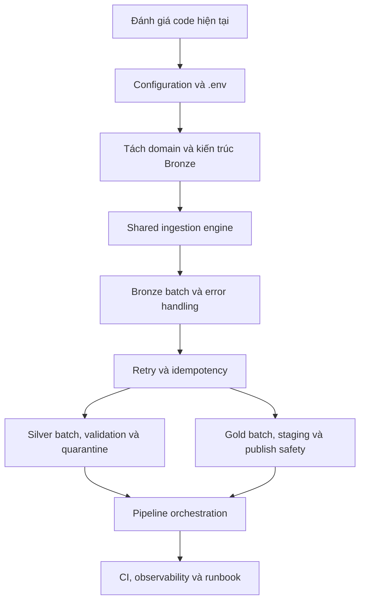

# Phase 4 - Kế hoạch Enhance Code và Execution Plan

## 1. Mục tiêu tài liệu

Tài liệu này tổng hợp các chủ đề đã review thành một quy trình triển khai thống nhất cho Phase 4. Đây là execution plan dùng làm căn cứ thực hiện code, viết test và cập nhật checklist.

Mục tiêu cuối cùng:

```text
Code hiện tại
  -> Configuration tập trung
      -> Kiến trúc domain rõ ràng
          -> Batch và streaming có kiểm soát
              -> Error handling và quarantine
                  -> Retry an toàn bằng idempotency
                      -> Silver/Gold staging và publish an toàn
                          -> Pipeline orchestration hoàn chỉnh
```

## 2. Nguyên tắc triển khai chung

| Nguyên tắc | Quyết định áp dụng |
|---|---|
| Không sửa theo triệu chứng | Xử lý từ abstraction và ownership trước, sau đó mới tối ưu từng stage |
| Không phá dữ liệu đã publish | Bronze/Silver/Gold đều build ở staging trước khi publish |
| Không retry mù | Chỉ retry transient error sau khi đã có idempotent boundary |
| Không silently drop dữ liệu | Row-level error phải quarantine; schema/system error phải fail closed |
| Không duplicate infrastructure logic | Batch, retry, audit, checkpoint và publish mechanics dùng shared service |
| Không tách file máy móc | Tách theo business domain; table đơn giản dùng `TableSpec` |
| Validation là pipeline gate | Validation failure phải ngăn downstream publish |
| Configuration là dependency | Settings được load và validate một lần rồi inject xuống các layer |
| Backward compatibility có kiểm soát | Giữ compatibility wrapper trong migration, không thêm logic mới vào wrapper |

## 3. Dependency giữa các chủ đề



Không nên triển khai retry trước batch identity, staging và transaction boundary. Không nên tối ưu Silver/Gold trước khi thống nhất Settings, result contract và error policy.

## 4. Tổng quan workstream

| ID | Workstream | Mục tiêu | Priority | Phụ thuộc | Kết quả chính |
|---|---|---|---|---|---|
| W0 | Đánh giá code hiện tại | Xác nhận baseline, ownership và rủi ro | P0 | Không | Review baseline và acceptance scope |
| W1 | Configuration | Tập trung `.env`, typed settings và secret policy | P0 | W0 | `Settings` dùng chung |
| W2 | Domain architecture | Tách job theo Sales/Production/Person | P0 | W0 | Domain jobs và `TableSpec` |
| W3 | Shared ingestion foundation | Chuẩn hóa result, batch, retry, audit và checkpoint models | P0 | W1, W2 | Shared ingestion services |
| W4 | Bronze reliability | Batch read, staging, quarantine và publish Bronze | P0 | W3 | Bronze pipeline an toàn |
| W5 | Retry/idempotency | Retry transient errors không tạo duplicate | P0 | W3, W4 | Retry policy và reconciliation |
| W6 | Silver reliability | Chunked read, transformation, global dedup và validation gate | P1 | W3, W5 | Silver job/service |
| W7 | Gold reliability | Fact batch/SQL staging, validation và atomic publish | P1 | W3, W5, W6 | Gold job/service |
| W8 | Orchestration | Một pipeline điều phối toàn bộ stage | P0 | W4, W6, W7 | `PipelineRunner` và CLI |
| W9 | Observability/delivery | Log, audit, CI, docs và runbook | P1 | W4-W8 | Evidence vận hành và CI |

## 5. Workstream W0 - Đánh giá code hiện tại

### Mục tiêu

Xác định chính xác behavior hiện tại trước khi refactor, bảo vệ backward compatibility và tránh sửa nhầm code không thuộc scope.

### Hiện trạng đã xác nhận

| Khu vực | Hiện trạng | Rủi ro |
|---|---|---|
| Branch | `Enhance_Project` tại commit `f6a681a`, cùng commit với `main` và `origin/main` | Cần giữ branch này làm branch triển khai Phase 4 |
| Runtime | `App.run()` chạy health check, bootstrap placeholder và Bronze; chưa chạy Silver/Gold | Chưa có end-to-end command |
| Configuration | Có `.env.example`, nhưng connector đọc `os.getenv()` riêng; có default credential | Cấu hình phân tán và có nguy cơ dùng default ngoài development |
| Bronze | `fetchall()` khi đọc; `to_sql(chunksize=1000)` chỉ batch lúc ghi | Memory cao, chưa retry/checkpoint/staging đầy đủ |
| Silver | Đọc toàn bảng bằng `read_sql_query()`; `errors="coerce"`; ghi `replace` | Có thể che giấu lỗi type và tạo Silver partial |
| Gold | Đọc toàn bảng; drop Gold trước khi build | Có thể mất Gold hợp lệ khi build fail |
| Retry | Chưa có retry/backoff/idempotency/checkpoint | Lỗi tạm thời fail ngay; retry tương lai có nguy cơ duplicate |
| Domain | Sales job đang chứa cả Product và Person | Ownership domain bị coupling |
| Test | Unit test có; integration test chạy khi service ngoài không sẵn sàng sẽ fail | Baseline test chưa tách rõ unit/integration |

### Task cần làm

| Step | Task | Output | Acceptance criteria | Status |
|---:|---|---|---|---|
| 0.1 | Chụp Git/test baseline | Branch, commit, test report | Evidence được lưu trong Phase 4 docs | Done |
| 0.2 | Lập dependency map | Sơ đồ App -> jobs -> connectors -> database | Các owner và ranh giới được xác định | Done |
| 0.3 | Xác nhận public API cần giữ | Danh sách import/entrypoint compatibility | Không phá caller cũ trong migration | Not started |
| 0.4 | Xác định required source/target tables | Table inventory và domain ownership | Mỗi table có owner rõ | Not started |

## 6. Workstream W1 - Configuration và biến môi trường

### Quyết định đã chốt

Dùng `pydantic-settings` làm cơ chế configuration duy nhất cho Python application.

```text
.env / process environment
  -> Settings loader
      -> validation
          -> App / PipelineRunner
              -> connectors, services và jobs
```

### Task và step

| Step | Task | Nội dung thực hiện | Output | Acceptance criteria | Priority | Status |
|---:|---|---|---|---|---|---|
| 1.1 | Thêm dependency | Thêm `pydantic-settings` vào `requirements.txt` | Dependency được pin/phù hợp Pydantic version | Import thành công trong environment | P0 | Not started |
| 1.2 | Tạo `Settings` | Tạo `src/core/settings.py` với `BaseSettings`, `SettingsConfigDict`, `SecretStr` và `get_settings()` cache | Central typed settings | `.env` được load; kiểu dữ liệu được parse đúng | P0 | Not started |
| 1.3 | Định nghĩa field | SQL Server, PostgreSQL, auth mode, batch size, retry, log level | Settings schema | Field name và default được document | P0 | Not started |
| 1.4 | Validate auth | Windows auth không cần user/password; SQL auth bắt buộc credential | Auth validation | Invalid auth config fail trước health check | P0 | Not started |
| 1.5 | Bảo vệ credential | `SecretStr`, không log password; default `postgres/postgres` chỉ development | Secret policy | Password không xuất hiện trong log/report | P0 | Not started |
| 1.6 | Inject settings | App, health service, connectors và jobs nhận cùng settings instance | Dependency injection | Không còn connector chính tự đọc `os.getenv()` | P0 | Not started |
| 1.7 | Cập nhật `.env.example` | Thêm auth mode, batch và retry variables | Environment template | Template khớp Settings schema | P1 | Not started |
| 1.8 | Viết settings tests | Test `.env`, override, missing fields, auth, defaults, invalid values | Unit tests | Tests chạy không cần database | P0 | Not started |

### Definition of Done W1

- [ ] Có một `Settings` object trung tâm.
- [ ] Process environment override `.env`.
- [ ] Password được bảo vệ bằng `SecretStr` và không xuất hiện trong log.
- [ ] Configuration lỗi fail trước khi health check.
- [ ] Connector không còn tự quản lý configuration riêng.

### Chi tiết implementation W1

| Task | Thực hiện như thế nào | Phải bảo đảm | Evidence bắt buộc |
|---|---|---|---|
| Settings model | Tạo `src/core/settings.py` dùng `BaseSettings`, `SettingsConfigDict(env_file=".env")`, `SecretStr`, `Field` và `get_settings()` cache | Process environment override `.env`; giá trị sai fail trước health check | Unit tests load/override/validation |
| Authentication | Thêm `SQL_SERVER_AUTH_MODE`; validate `windows` không cần credential, `sql` bắt buộc credential | Không fallback sai mode hoặc log credential | Auth matrix test |
| Secret policy | Dùng `SecretStr`; chỉ log safe summary gồm host/database/mode | Password không xuất hiện trong log, exception hoặc report | Redaction test |
| Injection | Truyền cùng Settings instance từ `main.py`/`App` xuống service, connector và job | Canonical connector không tự gọi `os.getenv()` | Constructor test và usage review |
| Environment template | Đồng bộ `.env.example`, thêm batch/retry fields; giữ `.env` trong `.gitignore` | Environment mới dựng được từ template, không chứa secret thật | Template consistency test |

### Rationale W1

| Quyết định | Lý do |
|---|---|
| Dùng `pydantic-settings` | Tập trung việc đọc `.env`, parse kiểu dữ liệu và validation vào một boundary; tránh mỗi connector tự diễn giải environment khác nhau |
| Dùng `SecretStr` | Giảm nguy cơ password xuất hiện khi in object/config hoặc tạo lỗi; việc lấy secret phải explicit bằng `get_secret_value()` |
| Cache `get_settings()` | Bảo đảm một process dùng cùng một configuration snapshot; tránh thay đổi behavior giữa các stage trong cùng run |
| Inject settings | Connector/job dễ unit test bằng settings giả; business code không phụ thuộc trực tiếp vào process environment |
| Không dùng default secret ngoài development | Thiếu credential phải fail sớm thay vì âm thầm chạy bằng credential không an toàn |

### Settings schema mẫu

```text
Settings
├── environment: development | test | staging | production
├── debug: bool
├── log_level: str
├── sql_server_host: str
├── sql_server_port: int
├── sql_server_database: str
├── sql_server_driver: str
├── sql_server_auth_mode: windows | sql
├── sql_server_username: str | null
├── sql_server_password: SecretStr | null
├── postgres_host: str
├── postgres_port: int
├── postgres_database: str
├── postgres_username: str
├── postgres_password: SecretStr
├── batch_size: int > 0
├── retry_max_attempts: 1..10
├── retry_initial_delay_seconds: float > 0
└── retry_max_delay_seconds: float > 0
```

The safe configuration summary may contain host, port, database, authentication mode, batch size, and retry limits. It must never contain password values.

## 7. Workstream W2 - Tách domain và kiến trúc Bronze

### Quyết định đã chốt

Tách theo business domain, không tạo một file/class cho từng table đơn giản.

```text
PipelineRunner
  -> SalesBronzeJob
  -> ProductionBronzeJob
  -> PersonBronzeJob
```

### Ownership

| Domain | Tables | Owner |
|---|---|---|
| Sales | `SalesOrderHeader`, `SalesOrderDetail`, `Customer`, `SalesTerritory`, `SalesPerson` | `SalesBronzeJob` |
| Production | `Product` | `ProductionBronzeJob` |
| Person | `Person` | `PersonBronzeJob` |

### Task và step

| Step | Task | Nội dung thực hiện | Output | Acceptance criteria | Priority | Status |
|---:|---|---|---|---|---|---|
| 2.1 | Tạo `TableSpec` | Metadata gồm source/target, primary key, required columns, ordering key, incremental column | `ingestion_models.py` hoặc domain table specs | Không còn extraction map hard-code trong `run()` | P0 | Not started |
| 2.2 | Tách Sales tables | Chỉ giữ 5 Sales tables trong Sales job | `sales_bronze_job.py` | Sales job không load Product/Person | P0 | Not started |
| 2.3 | Tạo Production job | Quản lý `Production.Product` | `production_bronze_job.py` | Product có result độc lập | P0 | Not started |
| 2.4 | Tạo Person job | Quản lý `Person.Person` | `person_bronze_job.py` | Person có result độc lập | P0 | Not started |
| 2.5 | Tạo shared engine | Domain job chỉ cung cấp specs/policy; engine sở hữu mechanics | Shared ingestion engine | Không duplicate batch/retry/audit code | P0 | Not started |
| 2.6 | Giữ compatibility wrapper | Wrapper delegate sang Sales job mới | Legacy import/entrypoint | Existing imports vẫn hoạt động | P1 | Not started |
| 2.7 | Viết domain tests | Test specs, ownership và result per domain | Unit tests | Domain fail không kéo theo domain khác | P1 | Not started |

### Definition of Done W2

- [ ] Product và Person không còn nằm trong Sales job.
- [ ] Table mapping nằm trong `TableSpec`.
- [ ] Shared engine không chứa business rule riêng của domain.
- [ ] Compatibility wrapper không chứa logic mới.

### Chi tiết implementation W2

| Task | Thực hiện như thế nào | Phải bảo đảm | Evidence bắt buộc |
|---|---|---|---|
| `TableSpec` | Tạo immutable dataclass cho source schema/table, target, primary key, required columns, ordering key và incremental column | Mapping không còn hard-code trong `run()` | Spec unit tests |
| Sales ownership | Tạo `SalesBronzeJob` chỉ xử lý Header, Detail, Customer, Territory, SalesPerson | Sales không load Product/Person | Ownership test |
| Other domains | Tạo `ProductionBronzeJob` cho Product và `PersonBronzeJob` cho Person | Mỗi domain có result/audit độc lập | Domain job tests |
| Shared boundary | Engine chứa batch/retry/staging/audit/checkpoint; domain chỉ truyền spec/policy | Không duplicate infrastructure và không đưa business rule vào shared layer | Architecture/import review |
| Compatibility | Cho `SalesBronzeIngestionJob` delegate sang Sales job mới | Import/signature cũ vẫn chạy; wrapper không có logic mới | Legacy regression test |

## 8. Workstream W3 - Shared ingestion foundation

### Mục tiêu

Tạo các model/service dùng chung cho Bronze, Silver và Gold.

### Thành phần đề xuất

```text
src/shared/ingestion/
├── ingestion_models.py
├── batch_ingestion_engine.py
├── retry_policy.py
├── checkpoint_manager.py
├── staging_manager.py
└── audit_service.py
```

### Result contract

Mỗi stage/table/batch trả về tối thiểu:

```python
{
    "run_id": "...",
    "stage": "bronze",
    "source_table": "Sales.SalesOrderDetail",
    "target_table": "bronze.sales_order_detail",
    "status": "SUCCESS",
    "rows_read": 0,
    "rows_written": 0,
    "rows_rejected": 0,
    "attempt_count": 1,
    "started_at": "...",
    "finished_at": "...",
    "error_type": None,
    "error_message": None,
}
```

### Chi tiết implementation W3

| Task | Thực hiện như thế nào | Phải bảo đảm | Evidence bắt buộc |
|---|---|---|---|
| Execution models | Tạo models cho run, table load, batch, status và error context | Mọi stage trả cùng result shape gồm counts, attempt, thời gian và lỗi | Model tests và sample JSON |
| Staging manager | Tạo staging name từ identifier đã validate; hỗ trợ cleanup/expire/publish | Không SQL injection từ identifier; published table chưa bị chạm trước publish | Staging safety test |
| Audit service | Ghi run/table/batch attempt, bounds, counts, status, timestamps và errors | Restart vẫn truy vấn được lịch sử | Audit schema/API test |
| Error classifier | Map database/network exception thành transient hoặc deterministic | Chỉ transient error được retry | Classifier tests |
| Retry executor | Nhận atomic operation, retry tối đa 3 lần với backoff+jitter; inject sleeper/clock khi test | Retry giữ cùng logical identity, không retry vô hạn | Retry tests |
| Checkpoint manager | Ghi checkpoint sau successful data commit, kèm key bounds | Không advance trước commit; unknown commit phải reconcile | Checkpoint tests |

### Schema mẫu W3

The shared foundation should expose these logical records. The physical PostgreSQL DDL may use equivalent names and types:

```sql
pipeline_run_audit (
    run_id UUID PRIMARY KEY,
    pipeline_name VARCHAR(200) NOT NULL,
    mode VARCHAR(30) NOT NULL,
    status VARCHAR(40) NOT NULL,
    started_at TIMESTAMPTZ NOT NULL,
    finished_at TIMESTAMPTZ,
    error_count INTEGER NOT NULL DEFAULT 0
);

table_load_audit (
    load_id UUID PRIMARY KEY,
    run_id UUID NOT NULL,
    stage VARCHAR(30) NOT NULL,
    source_table VARCHAR(300) NOT NULL,
    target_table VARCHAR(300) NOT NULL,
    status VARCHAR(40) NOT NULL,
    rows_read BIGINT NOT NULL DEFAULT 0,
    rows_written BIGINT NOT NULL DEFAULT 0,
    rows_rejected BIGINT NOT NULL DEFAULT 0,
    attempt_count INTEGER NOT NULL DEFAULT 0,
    error_type VARCHAR(200),
    error_message TEXT,
    started_at TIMESTAMPTZ NOT NULL,
    finished_at TIMESTAMPTZ
);

batch_load_audit (
    batch_id UUID PRIMARY KEY,
    load_id UUID NOT NULL,
    batch_number INTEGER NOT NULL,
    lower_bound TEXT,
    upper_bound TEXT,
    rows_read BIGINT NOT NULL DEFAULT 0,
    rows_written BIGINT NOT NULL DEFAULT 0,
    rows_rejected BIGINT NOT NULL DEFAULT 0,
    attempt_count INTEGER NOT NULL DEFAULT 0,
    status VARCHAR(40) NOT NULL,
    committed_at TIMESTAMPTZ
);
```

`run_id`, `load_id`, and `batch_id` identify logical work. `attempt_count` identifies physical attempts and must not create a new logical identity.

### Task và step

| Step | Task | Nội dung thực hiện | Output | Acceptance criteria | Priority | Status |
|---:|---|---|---|---|---|---|
| 3.1 | Chuẩn hóa status | `SUCCESS`, `SUCCESS_WITH_REJECTIONS`, `PARTIAL_SUCCESS`, `FAILED`, `RETRYING`, `QUARANTINED` | Status enum/model | Các stage dùng cùng status vocabulary | P0 | Not started |
| 3.2 | Tạo run/load/batch IDs | Identity ổn định cho execution | ID generation/model | Retry không tạo logical identity mới | P0 | Not started |
| 3.3 | Tạo audit models | Run/table/batch audit fields | Audit service/model | Mọi attempt và outcome có record | P0 | Not started |
| 3.4 | Tạo staging manager | Tạo, cleanup, publish/swap staging | Staging service | Published table không bị chạm trước validation | P0 | Not started |
| 3.5 | Tạo error classifier | Phân biệt transient và deterministic errors | Retry classifier | Chỉ transient error được retry | P0 | Not started |
| 3.6 | Tạo shared test fixtures | Fake extractor/loader/audit/database | Test fixtures | Test mechanics không cần live database | P0 | Not started |

## 9. Workstream W4 - Bronze reliability

### Baseline đã chốt

```text
SQL Server cursor
  -> fetchmany(10,000)
      -> DataFrame batch
          -> lineage/hash
              -> batch validation
                  -> valid rows -> staging
                  -> invalid rows -> bronze.rejected_records
                      -> commit batch
                          -> checkpoint
                              -> full-table validation
                                  -> publish Bronze
```

### Task và step

| Step | Task | Nội dung thực hiện | Output | Acceptance criteria | Priority | Status |
|---:|---|---|---|---|---|---|
| 4.1 | Đổi extractor sang batch | `fetchmany(batch_size)`, query có `ORDER BY` ổn định | Batch iterator | Canonical Bronze không dùng `fetchall()` | P0 | Not started |
| 4.2 | Tạo staging table | Run/load-specific staging | Staging Bronze | Bronze cũ không bị replace khi run đang chạy | P0 | Not started |
| 4.3 | Giữ raw fidelity | Không business dedup tại Bronze | Raw Bronze | Dedup được chuyển sang Silver | P0 | Not started |
| 4.4 | Batch validation | Validate schema, lineage, basic required fields | Batch validation report | Lỗi được phân loại rõ | P0 | Not started |
| 4.5 | Quarantine row-level | Ghi rejected row, reason, record key, run/load/batch identity | `bronze.rejected_records` | Không silently drop row lỗi | P0 | Not started |
| 4.6 | Full-load safety | Validate toàn staging rồi publish | Publish operation | Bronze cũ giữ nguyên nếu load fail | P0 | Not started |
| 4.7 | Table isolation | Per-table try/except và structured result | Table result map | Một table fail không làm mất result table khác | P1 | Not started |
| 4.8 | Audit/checkpoint | Ghi rows read/written/rejected, attempt, bounds, status | Audit records | Có thể điều tra và resume | P1 | Not started |
| 4.9 | Bronze tests | Test batch, failure, quarantine, staging, rerun | Unit/integration tests | Acceptance scenarios pass | P0 | Not started |

### Bronze error policy

| Error | Xử lý |
|---|---|
| Connection/query transient | Retry cùng batch |
| Missing table/column/schema | Fail table, không retry |
| Write failure trước commit | Rollback batch, retry |
| Commit outcome không rõ | Reconcile staging/audit trước retry |
| Row-level data error | Quarantine row, valid row tiếp tục |
| Rejected vượt threshold | `FAILED`, không publish |
| Full load fail | Giữ Bronze cũ |

### Chi tiết implementation W4

| Task | Thực hiện như thế nào | Phải bảo đảm | Evidence bắt buộc |
|---|---|---|---|
| Batch extractor | Dùng cursor `fetchmany(10_000)` với query `ORDER BY` ổn định; yield DataFrame và bounds | Canonical Bronze không dùng `fetchall()`; memory giới hạn theo batch | Fake-cursor extractor test |
| Lineage/hash | Tính `_source_system`, `_source_table`, `_load_date`, `_record_hash` cho từng batch | Hash không phụ thuộc metadata thay đổi theo run | Lineage/hash regression test |
| Quarantine | Tách valid/rejected row; ghi rejected với reason, key, run/load/batch identity | Không silently drop; schema/system error không thành row quarantine | Quarantine test |
| Staging transaction | Ghi valid rows vào run-specific staging, commit từng batch; rollback khi write fail | Retry không duplicate; Bronze cũ không bị ảnh hưởng | Transaction test |
| Full validation/publish | Validate source-vs-staging count, schema, lineage, key và threshold rồi publish/swap | Không publish staging thiếu hoặc invalid | Publish preservation test |
| Table isolation | Bọc extract/load/validate theo table, trả result từng table | Một table fail không làm mất result table khác | Failure-isolation test |
| Incremental | Dùng stable watermark/key range, checkpoint transactional và không dùng offset | Cùng input rerun không duplicate | Incremental rerun test |

### Bronze schema và failure lifecycle chi tiết

Quarantine table mẫu:

```sql
bronze.rejected_records (
    rejected_id BIGSERIAL PRIMARY KEY,
    run_id UUID NOT NULL,
    load_id UUID NOT NULL,
    batch_id UUID NOT NULL,
    source_table VARCHAR(300) NOT NULL,
    record_key VARCHAR(300),
    source_row_hash CHAR(64),
    error_type VARCHAR(200) NOT NULL,
    error_message TEXT NOT NULL,
    raw_payload JSONB,
    rejected_at TIMESTAMPTZ NOT NULL DEFAULT CURRENT_TIMESTAMP
);
```

`raw_payload` is optional and must follow the data-classification policy. Normal application logs must contain only the key/hash and error metadata.

Failure lifecycle:

```text
START TABLE LOAD
  -> validate TableSpec and source schema
      -> schema/system error: FAILED, no staging publish
  -> create run-specific staging
      -> fetch batch
          -> transient read error: retry same batch identity
          -> deterministic query error: FAILED, keep Bronze old
      -> validate rows
          -> valid rows: staging
          -> isolatable row errors: bronze.rejected_records
      -> write staging batch
          -> error before commit: rollback and retry
          -> unknown commit: reconcile audit/staging before retry
      -> commit data and checkpoint
      -> repeat until source exhausted
  -> validate whole staging and rejected threshold
      -> threshold exceeded: FAILED, cleanup/expire staging
      -> pass: atomic publish to Bronze
  -> write final table/run audit
```

Guarantees:

| Situation | Guarantee |
|---|---|
| Source/database failure | Published Bronze remains unchanged |
| Batch retry | Same logical batch cannot create duplicate rows |
| Row rejection | Rejected row has reason and identity; it is never silently discarded |
| Checkpoint | It never moves ahead of committed data |
| Partial staging | It is not visible as the published Bronze table |

## 10. Workstream W5 - Retry và idempotency

### Mục tiêu

Đảm bảo retry tăng khả năng phục hồi nhưng không tạo duplicate hoặc làm sai checkpoint.

### Quy tắc retry

| Rule | Quyết định |
|---|---|
| Retryable | Timeout, connection reset, temporary unavailable, deadlock |
| Non-retryable | Schema, auth, invalid SQL, contract, deterministic validation |
| Max attempts | 3 |
| Backoff | Exponential backoff + jitter, giới hạn maximum |
| Identity | Giữ nguyên `run_id`, `load_id/table_load_id`, `batch_id` |
| Checkpoint | Chỉ ghi sau successful commit |
| Unknown commit | Query/reconcile trước khi retry |
| Duplicate protection | Unique record/batch identity và constraint/upsert phù hợp |

### Task và step

| Step | Task | Nội dung thực hiện | Output | Acceptance criteria | Priority | Status |
|---:|---|---|---|---|---|---|
| 5.1 | Error classifier | Map exception database/network vào transient/deterministic | Classifier | Không retry lỗi deterministic | P0 | Not started |
| 5.2 | Retry executor | Retry atomic unit với max attempts/backoff/jitter | Retry service | Attempt count và delay được log | P0 | Not started |
| 5.3 | Batch identity | Reuse identity giữa các attempts | Batch model | Retry không tạo batch mới | P0 | Not started |
| 5.4 | Reconciliation | Kiểm tra staging/audit/unique key sau unknown commit | Reconciliation service | Không append mù sau timeout | P0 | Not started |
| 5.5 | Checkpoint manager | Ghi checkpoint cùng successful data commit | Checkpoint service | Không advance trước commit | P0 | Not started |
| 5.6 | Retry tests | Test lỗi trước commit, sau commit và rerun | Regression tests | Không duplicate và checkpoint đúng | P0 | Not started |

### Chi tiết implementation W5

| Task | Thực hiện như thế nào | Phải bảo đảm | Evidence bắt buộc |
|---|---|---|---|
| Identity | Dùng `run_id`, `load_id/table_load_id`, `batch_id`, `record_key`; attempt chỉ là lần thử | Cùng logical operation luôn được nhận diện giống nhau | Identity model test |
| Retry before commit | Rollback atomic unit rồi retry cùng identity | Không sinh duplicate staging row | Transaction retry test |
| Unknown commit | Query audit/staging/unique key trước khi retry | Không append mù sau timeout | Reconciliation test |
| Retry exhaustion | Hết 3 attempts thì mark batch/table/stage `FAILED` và không publish | Không retry vô hạn hoặc che giấu lỗi | Exhaustion test |
| Logging | Log attempt, delay, error class, identity, counts và outcome | Không log secret/full payload | Log redaction test |

### Log mẫu W5

Retry before commit:

```text
2026-09-03T10:15:02Z WARNING stage=bronze source_table=Sales.SalesOrderDetail target_table=bronze.sales_order_detail run_id=run-001 load_id=load-001 batch_id=batch-007 attempt=1 error_type=ConnectionTimeout status=RETRYING retry_after_seconds=2
```

Unknown commit reconciliation:

```text
2026-09-03T10:15:05Z INFO stage=bronze load_id=load-001 batch_id=batch-007 attempt=2 status=RECONCILING staging_rows=10000 audit_status=COMMITTED action=SKIP_INSERT
```

Retry exhausted:

```text
2026-09-03T10:15:09Z ERROR stage=bronze load_id=load-001 batch_id=batch-007 attempt=3 error_type=ConnectionTimeout status=FAILED rows_read=70000 rows_written=60000 rows_rejected=0 publish=false
```

## 11. Workstream W6 - Silver reliability

### Baseline đã chốt

```text
Bronze
  -> chunked DataFrame 10,000 rows
      -> pandas transform deterministic
          -> valid -> Silver staging
          -> invalid -> silver.rejected_records
              -> commit chunk/checkpoint
                  -> global dedup on staging
                      -> validation gate
                          -> atomic Silver publish
```

### Task và step

| Step | Task | Nội dung thực hiện | Output | Acceptance criteria | Priority | Status |
|---:|---|---|---|---|---|---|
| 6.1 | Đóng gói Silver job | Chuyển script `run()` thành service/job inject được | Silver job | Gọi được từ App/CLI/test | P0 | Not started |
| 6.2 | Chunked read | Dùng `read_sql_query(chunksize=10_000)` hoặc reader abstraction | Chunk iterator | Không load full Bronze table | P0 | Not started |
| 6.3 | Input schema contract | Validate required columns trước transform | Schema validator | Missing column fail table rõ ràng | P0 | Not started |
| 6.4 | Conversion validation | Phát hiện giá trị bị `errors="coerce"` thành null ngoài ý muốn | Conversion validator | Invalid row có reason | P0 | Not started |
| 6.5 | Silver quarantine | Ghi `silver.rejected_records` với transform version | Rejected records | Row lỗi không mất và không vào Gold | P0 | Not started |
| 6.6 | Global dedup | SQL window/staging, không dedup từng chunk | Deduped staging | Key duplicate được xử lý deterministic | P0 | Not started |
| 6.7 | Person dependency | Thiếu `bronze.person` làm fail salesperson table trừ degraded mode được duyệt | Dependency validation | Không fallback âm thầm về ID | P0 | Not started |
| 6.8 | Silver publish | Validate toàn staging rồi swap | Atomic publish | Silver cũ giữ nguyên khi fail | P0 | Not started |
| 6.9 | Silver retry/tests | Retry transient cùng batch identity; test validation/quarantine/rerun | Test evidence | Acceptance scenarios pass | P0 | Not started |

### Silver error policy

| Error | Xử lý |
|---|---|
| Missing table/column | Fail closed, không publish |
| Invalid type value trong row | Quarantine với reason |
| Database transient error | Retry cùng chunk |
| Unknown commit | Reconcile staging/audit |
| Duplicate business key | Global deterministic dedup trên staging |
| Rejected vượt threshold | Fail table, không publish |
| Missing Person dependency | Fail salesperson table |

### Chi tiết implementation W6

| Task | Thực hiện như thế nào | Phải bảo đảm | Evidence bắt buộc |
|---|---|---|---|
| Silver job | Đóng gói script `run()` thành injectable job; CLI cũ delegate | PipelineRunner gọi được, public API cũ có compatibility | Job contract test |
| Chunked reader | Dùng `read_sql_query(chunksize=10_000)` hoặc reader abstraction | Không load full Bronze table trong canonical path | Reader test |
| Schema contract | Kiểm tra required columns trước transform | Missing table/column fail closed, không quarantine toàn bảng | Contract tests |
| Conversion checks | So sánh raw/converted values để phát hiện `errors="coerce"` ngoài ý muốn | Invalid row có reason; optional null theo schema policy | Conversion tests |
| Global dedup | Stage đủ chunks rồi dùng SQL window/stable ordering | Không dedup độc lập từng chunk | Cross-chunk duplicate test |
| Person dependency | Kiểm tra `bronze.person` trước salesperson transform; không fallback ID âm thầm | Thiếu dependency fail rõ hoặc degraded mode được duyệt | Dependency test |
| Publish | Validate staging rồi atomic publish; giữ Silver cũ khi fail | Gold không đọc Silver partial | Publish safety test |

### Silver rationale và failure lifecycle

| Quyết định | Lý do |
|---|---|
| Chunked DataFrame read | Giảm memory và giữ compatibility với các cleaner pandas hiện tại |
| Database-side global dedup | Dedup theo từng chunk không xử lý được duplicate nằm ở hai chunk khác nhau |
| Quarantine row-level | Giữ được row hợp lệ và bảo toàn thông tin row lỗi để sửa/replay |
| Fail closed cho schema/system | Lỗi contract ảnh hưởng toàn bảng, không thể xử lý như một vài row lỗi |
| Silver staging | Gold chỉ được đọc Silver version đã hoàn thành và validate |

Silver failure lifecycle:

```text
START SILVER TABLE
  -> identify Bronze snapshot/load
      -> validate required input columns
          -> missing table/column: FAILED, keep Silver old
      -> read Bronze chunk
          -> transient read error: retry same batch identity
          -> transform chunk
              -> conversion error on row: quarantine with reason/source hash
              -> transformation/system error: FAILED, no publish
      -> write valid rows to Silver staging
          -> write failure: rollback/retry; reconcile unknown commit
      -> commit chunk and checkpoint
  -> repeat all chunks
  -> global dedup on complete staging
  -> validate output schema, nulls, keys, joins, and rejected threshold
      -> fail: cleanup staging, keep Silver old
      -> pass: atomic publish/swap
  -> write final audit and result status
```

Required Silver quarantine fields:

```text
run_id, table_load_id, batch_id, source_table, target_table,
record_key, source_row_hash, error_type, error_message,
transform_version, rejected_at
```

## 12. Workstream W7 - Gold reliability

### Baseline đã chốt

```text
Silver snapshot/load
  -> dimensions nhỏ: full-read được phép
      -> fact_sales: SQL-side JOIN hoặc stable batch
          -> run-specific Gold staging
              -> validate schema/grain/keys/measures/references
                  -> constraints trên staging
                      -> atomic publish/swap
                          -> giữ Gold cũ nếu fail
```

### Task và step

| Step | Task | Nội dung thực hiện | Output | Acceptance criteria | Priority | Status |
|---:|---|---|---|---|---|---|
| 7.1 | Đóng gói Gold job | Chuyển script thành job/service | Gold job | Gọi được từ PipelineRunner | P0 | Not started |
| 7.2 | Tách dimension/fact strategy | Dimension full-read; fact batch/SQL | Gold build plan | Không ép streaming dimension nhỏ | P1 | Not started |
| 7.3 | Fact SQL staging | Join detail/header trong PostgreSQL nếu phù hợp | Staging fact | Giữ đúng line-item grain | P0 | Not started |
| 7.4 | Fact batch fallback | Nếu pandas, đọc theo stable key range/chunk | Batch fact loader | Không dùng offset checkpoint | P1 | Not started |
| 7.5 | Fact integrity | Unique `sales_order_detail_id`, no silent dedup | Fact validation | Duplicate key fail closed | P0 | Not started |
| 7.6 | Pre-publish validation | Schema, null, grain, FK, measure, KPI checks | Validation report | Validation fail không publish | P0 | Not started |
| 7.7 | Constraints | Add/verify PK/FK trên staging trước publish | Validated staging | Gold contract ổn định | P1 | Not started |
| 7.8 | Atomic publish | Swap/publish sau khi mọi check pass | Gold version | Gold cũ không đổi khi build fail | P0 | Not started |
| 7.9 | Gold retry/tests | Retry transient, reconcile unknown commit, test publish safety | Test evidence | Acceptance scenarios pass | P0 | Not started |

### Chi tiết implementation W7

| Task | Thực hiện như thế nào | Phải bảo đảm | Evidence bắt buộc |
|---|---|---|---|
| Gold job | Đóng gói Gold script thành injectable job | PipelineRunner gọi được và trả result chuẩn | Job contract test |
| Dimension strategy | Full-read dimension nhỏ; validate schema/key trước staging | Không over-engineer streaming dimension | Dimension tests |
| Fact strategy | Ưu tiên SQL-side JOIN/staging; pandas stable key batch là fallback | Fact giữ một row/detail | Fact grain/count tests |
| Fact identity | Unique `sales_order_detail_id`; reconcile unknown commit | Retry không duplicate fact | Duplicate/reconcile tests |
| Pre-publish validation | Check schema, null, PK, FK/orphan, measure và KPI contract | Integrity failure chặn publish | Validation tests |
| Safe publish | Không reset Gold trước build; swap sau validation | Gold cũ vẫn hoạt động khi build fail | Failure preservation test |
| Error policy | Không quarantine Gold mặc định; lỗi upstream xử lý ở Silver | Gold không silently drop fact | Policy test |

### Gold rationale, schema và failure lifecycle

| Quyết định | Lý do |
|---|---|
| Full-read dimensions nhỏ | Chi phí và độ phức tạp streaming không đem lại lợi ích đáng kể ở volume hiện tại |
| SQL-side fact JOIN | Join gần dữ liệu, giảm memory Python và tận dụng query planner/index |
| Stable key checkpoint | `sales_order_detail_id` là grain key; offset không ổn định khi rerun |
| No Gold quarantine | Gold phải toàn vẹn cho analytics; lỗi row-level phải được xử lý từ Silver |
| Validate before publish | Phát hiện lỗi trước khi tác động Gold đang phục vụ Power BI |
| Atomic publish/swap | Giữ Gold version cuối cùng luôn khả dụng khi build mới thất bại |

Gold staging schema mẫu:

```text
gold_staging_<run_id>.dim_customer
    PRIMARY KEY (customer_id)

gold_staging_<run_id>.fact_sales
    PRIMARY KEY (sales_order_detail_id)
    FOREIGN KEY (order_date_id) REFERENCES dim_date(date_id)
    FOREIGN KEY (customer_id) REFERENCES dim_customer(customer_id)
    FOREIGN KEY (product_id) REFERENCES dim_product(product_id)
    FOREIGN KEY (territory_id) REFERENCES dim_territory(territory_id)
    FOREIGN KEY (salesperson_id) REFERENCES dim_salesperson(salesperson_id)
```

Gold failure lifecycle:

```text
START GOLD RUN
    -> identify one Silver snapshot/load
            -> validate required Silver tables/columns
                    -> missing contract: FAILED, keep Gold old
            -> build dimensions in staging
            -> build fact via SQL JOIN or stable key batches
                    -> transient database error: retry same atomic unit
                    -> unknown commit: reconcile staging/audit/unique key
                    -> deterministic duplicate/orphan/measure error: FAILED
            -> validate staging schema, grain, nulls, measures, PK/FK and KPI contract
                    -> fail: cleanup/expire staging, do not publish
                    -> pass: add/verify constraints
            -> atomic publish/swap
            -> write final Gold audit and version metadata
```

Gold must never execute the old sequence `DROP published Gold -> build -> to_sql(replace)`. A failed build must leave the previous published version unchanged.

Gold log samples:

```text
2026-09-03T11:00:00Z INFO stage=gold run_id=run-001 table_load_id=gold-load-001 status=STARTED source_snapshot=silver-load-042
2026-09-03T11:04:12Z ERROR stage=gold target_table=gold.fact_sales run_id=run-001 error_type=ReferentialIntegrityError orphan_rows=14 status=FAILED publish=false
2026-09-03T11:05:01Z INFO stage=gold run_id=run-001 status=PUBLISHED tables=6 previous_version=gold-v001 new_version=gold-v002
```

### Gold error policy

| Error | Xử lý |
|---|---|
| Transient database error | Retry atomic unit |
| Missing Silver table/column | Fail closed |
| Duplicate fact key | Fail closed, không silently dedup |
| Orphan dimension key | Fail closed trước publish |
| Measure/business-rule violation | Fail closed |
| Row-level source conversion error | Phải xử lý từ Silver |
| Build fail sau staging commit | Giữ Gold cũ, cleanup/expire staging lỗi |

## 13. Workstream W8 - Pipeline orchestration

### Mục tiêu

Tạo một command điều phối có kiểm soát:

```text
health/readiness
  -> bootstrap
      -> Bronze domains
          -> Silver
              -> Silver validation
                  -> Gold
                      -> Gold validation/KPI
```

### Task và step

| Step | Task | Nội dung thực hiện | Output | Acceptance criteria | Priority | Status |
|---:|---|---|---|---|---|---|
| 8.1 | Pipeline contract | Chuẩn hóa stage result và failure policy | Pipeline contract | Stage status machine-readable | P0 | Not started |
| 8.2 | Health gate | Health/config/readiness fail thì dừng downstream | Gate logic | Không chạy Bronze khi dependency fail | P0 | Not started |
| 8.3 | Bootstrap thật | Schema/metadata/version idempotent | Bootstrap job | Có thể chạy nhiều lần | P1 | Not started |
| 8.4 | Điều phối domain jobs | Gọi Sales/Production/Person theo policy | Pipeline runner | Domain result độc lập | P0 | Not started |
| 8.5 | Điều phối Silver/Gold | Gọi job và validation theo thứ tự | End-to-end flow | Validation fail chặn publish | P0 | Not started |
| 8.6 | CLI | Mode, stage selection, log level, dry-run nếu cần | CLI command | Invalid option fail rõ | P0 | Not started |
| 8.7 | Exit code | `0` chỉ khi required stages success | Process result | Automation detect được failure | P0 | Not started |
| 8.8 | Pipeline tests | Mock stage sequencing, gate và failure | Orchestration tests | Không cần live DB | P0 | Not started |

### Chi tiết implementation W8

| Task | Thực hiện như thế nào | Phải bảo đảm | Evidence bắt buộc |
|---|---|---|---|
| Contract | Chuẩn hóa stage order, required stages, result và final status | Silver validation fail thì Gold không chạy | Contract tests |
| Gate | Load Settings, health và readiness trước stage đầu tiên | Config/dependency fail thì không chạy downstream | Gate tests |
| Domain execution | Gọi Sales/Production/Person jobs theo policy và tổng hợp result | Domain fail không làm mất context domain khác | Orchestration tests |
| Stage execution | Gọi Bronze -> Silver -> Silver validation -> Gold -> KPI validation | Thứ tự được kiểm tra bằng fake jobs | Sequence test |
| CLI/exit code | Thêm mode, stage selection, log level, exit code | Automation phân biệt success/failure | CLI tests |

## 14. Workstream W9 - Observability, CI và documentation

### Task và step

| Step | Task | Nội dung thực hiện | Output | Acceptance criteria | Priority | Status |
|---:|---|---|---|---|---|---|
| 9.1 | Structured logging | Log run/stage/table/batch/attempt/status/duration | Log schema | Filter được theo identity | P1 | Not started |
| 9.2 | Audit tables | Pipeline/table/batch/rejected audit | Database metadata | Có lịch sử vận hành | P1 | Not started |
| 9.3 | Summary report | JSON/Markdown stage summary | Run evidence | Có counts, errors, durations | P1 | Not started |
| 9.4 | Integration markers | Mark database-dependent tests | Pytest config | Unit test chạy độc lập | P0 | Not started |
| 9.5 | Integration setup | Docker PostgreSQL và SQL Server prerequisite | Runbook | Integration setup reproducible | P1 | Blocked |
| 9.6 | CI checks | Unit, lint, format, type-check, integration-aware tests | CI workflow | Quality gate trước merge | P1 | Not started |
| 9.7 | Update docs | README, runbook, Phase 4 checklist | Documentation | Docs khớp runtime thực tế | P1 | Not started |

### Chi tiết implementation W9

| Task | Thực hiện như thế nào | Phải bảo đảm | Evidence bắt buộc |
|---|---|---|---|
| Structured logging | Chuẩn hóa run/stage/table/batch/attempt/status/duration/error | Có thể filter và correlate một run | Log schema/test |
| Audit persistence | Tạo DDL/migration cho run/table/batch/rejected records | Audit còn tồn tại sau restart | SQL migration và integration test |
| Summary report | Xuất JSON/Markdown gồm counts, errors, durations | Reviewer có một evidence artifact | Report fixture test |
| Test separation | Mark integration tests; unit command không cần database | `pytest -m "not integration"` deterministic | Pytest config và test run |
| CI | Chạy unit, lint, format, type check; integration khi service sẵn sàng | Merge có quality gate | CI workflow evidence |
| Runbook | Ghi setup, one-command run, recovery, staging cleanup và rollback | Operator làm theo được mà không đọc source | Runbook review |

### Log schema chung

Các field sau là tối thiểu cho event pipeline, với field áp dụng được theo stage:

| Field | Bắt buộc | Mục đích |
|---|---:|---|
| `timestamp` | Có | Thời điểm event theo UTC |
| `level` | Có | `INFO`, `WARNING`, `ERROR` |
| `run_id` | Có | Correlate toàn pipeline run |
| `stage` | Có | `bronze`, `silver`, `gold`, `validation` |
| `source_table` | Theo table | Xác định nguồn |
| `target_table` | Theo table | Xác định đích |
| `load_id`/`table_load_id` | Theo load | Correlate table load |
| `batch_id` | Theo batch | Correlate chunk/batch |
| `attempt` | Khi retry | Xác định lần thử |
| `rows_read` | Khi xử lý dữ liệu | Đo input |
| `rows_written` | Khi ghi dữ liệu | Đo output |
| `rows_rejected` | Khi có quarantine | Đo lỗi cấp record |
| `error_type` | Khi lỗi | Phân loại lỗi |
| `status` | Có | Trạng thái event/operation |
| `duration_ms` | Khi kết thúc | Đo runtime |

Example structured event:

```json
{
    "timestamp": "2026-09-03T11:04:12Z",
    "level": "ERROR",
    "run_id": "run-001",
    "stage": "gold",
    "target_table": "gold.fact_sales",
    "table_load_id": "gold-load-001",
    "error_type": "ReferentialIntegrityError",
    "orphan_rows": 14,
    "status": "FAILED",
    "publish": false
}
```

## 15. Execution order đề xuất

### Phase 4A - Foundation

1. Hoàn tất W0 baseline và API compatibility.
2. Implement W1 `pydantic-settings`.
3. Implement W2 domain ownership và `TableSpec`.
4. Implement W3 shared result/staging/audit/retry models.
5. Chạy unit tests foundation.

### Phase 4B - Bronze

1. Đổi Bronze extractor sang `fetchmany(10_000)`.
2. Tạo staging và batch audit.
3. Implement quarantine row-level.
4. Implement full-table validation và publish.
5. Implement retry/idempotency/reconciliation.
6. Chạy Bronze regression tests.

### Phase 4C - Silver

1. Đóng gói Silver thành job/service.
2. Chunked read và deterministic pandas transform.
3. Input/conversion validation.
4. Quarantine row-level.
5. Global dedup trên staging.
6. Validation gate và atomic publish.
7. Chạy Silver regression tests.

### Phase 4D - Gold

1. Đóng gói Gold thành job/service.
2. Giữ full-read cho dimension nhỏ.
3. Implement SQL-side fact staging hoặc stable batch fallback.
4. Pre-publish integrity validation.
5. Constraints trên staging.
6. Atomic publish/swap và retry an toàn.
7. Chạy Gold regression tests.

### Phase 4E - Orchestration và delivery

1. Implement health/readiness gate.
2. Implement bootstrap thật.
3. Tạo `PipelineRunner` và CLI.
4. Thêm exit codes và summary report.
5. Mark integration tests và thiết lập CI.
6. Cập nhật README/runbook/checklist.

## 18. Quy trình thực hiện mỗi task

Mỗi task trong bảng trên phải đi qua quy trình sau:

| Bước | Việc phải làm | Điều kiện hoàn thành |
|---:|---|---|
| 1 | Xác định owner, file/symbol bị ảnh hưởng và dependency | Có task scope cụ thể, không sửa lan sang domain khác |
| 2 | Viết hoặc cập nhật contract/test trước khi sửa logic phức tạp | Có test mô tả behavior mong muốn hoặc lý do không thể test unit |
| 3 | Implement thay đổi nhỏ nhất theo baseline đã chốt | Không thêm fallback trái policy; không phá public API ngoài scope |
| 4 | Chạy focused validation ngay sau edit | Test slice, type check hoặc lint liên quan phải pass |
| 5 | Chạy regression suite phù hợp | Không làm giảm test hiện có; integration failure phải phân biệt môi trường |
| 6 | Kiểm tra log/audit/security | Không lộ secret; status/count/error khớp thực tế |
| 7 | Cập nhật evidence và checklist | Có file, command, kết quả và status mới |
| 8 | Review dependency trước task tiếp theo | Chỉ chuyển task phụ thuộc sang `Done` khi prerequisite đã hoàn tất |

## 19. Quy tắc status và evidence

| Status | Cách dùng |
|---|---|
| `Not started` | Chưa có implementation/test evidence |
| `In progress` | Đang sửa code hoặc test; chưa đủ acceptance |
| `Done` | Code, focused test, regression test và evidence đã pass |
| `Blocked` | Có dependency môi trường hoặc quyết định chưa khả dụng; phải ghi rõ blocker |
| `Needs clarification` | Business rule hoặc contract chưa được phê duyệt; không tự ý implement |

Không đánh dấu `Done` nếu chỉ có unit test pass nhưng chưa kiểm tra acceptance liên quan đến transaction, idempotency, publish safety, quarantine hoặc security.

## 20. Mapping task với tài liệu review

| Chủ đề review | Workstream triển khai |
|---|---|
| Đánh giá code hiện tại | W0 |
| Configuration và `.env` | W1 |
| Batch/streaming Bronze | W3, W4 |
| Error/quarantine Bronze | W3, W4, W5 |
| Retry/idempotency | W3, W5 |
| Tách domain/kiến trúc Bronze | W2 |
| Batch/error Silver | W3, W5, W6 |
| Batch/publish safety Gold | W3, W5, W7 |
| Pipeline end-to-end | W8 |
| Logging/audit/CI/runbook | W9 |

## 21. Definition of Done Phase 4

- [ ] Configuration tập trung bằng `pydantic-settings` và không lộ secret.
- [ ] Bronze được tách ownership theo Sales/Production/Person.
- [ ] Shared ingestion engine quản lý batch, staging, retry, audit và checkpoint.
- [ ] Bronze đọc bằng batch, không dùng `fetchall()` trong canonical path.
- [ ] Bronze dùng quarantine mode cho lỗi cấp record.
- [ ] Bronze schema/system error fail closed.
- [ ] Silver đọc theo chunk, transform deterministic và dedup toàn cục.
- [ ] Silver lỗi cấp record được quarantine; lỗi schema/system fail closed.
- [ ] Gold fact được build theo SQL staging hoặc stable batch.
- [ ] Gold không drop bảng publish trước khi build/validation thành công.
- [ ] Gold integrity/business-rule error fail closed, không quarantine mặc định.
- [ ] Retry chỉ áp dụng transient error và giữ identity ổn định.
- [ ] Commit không rõ trạng thái được reconcile trước retry.
- [ ] Có một command chạy pipeline theo thứ tự bắt buộc.
- [ ] Health/readiness và validation hoạt động như pipeline gate.
- [ ] Unit/integration test được phân loại rõ.
- [ ] Có structured logs, audit và summary report.
- [ ] README, runbook và checklist phản ánh đúng runtime.

## 22. Tài liệu liên quan

- [PHASE_4_REVIEW_ENHANCE_CODE_VI.md](PHASE_4_REVIEW_ENHANCE_CODE_VI.md)
- [phase4_review_enhance_code_checklist.md](../ToDoCheckList/Phase_4_Review%26Enhance_Code/phase4_review_enhance_code_checklist.md)
- [CURRENT_CODE_WORKFLOW_OVERVIEW.md](CURRENT_CODE_WORKFLOW_OVERVIEW.md)
- [phase2_architecture_spec.md](phase2_architecture_spec.md)
